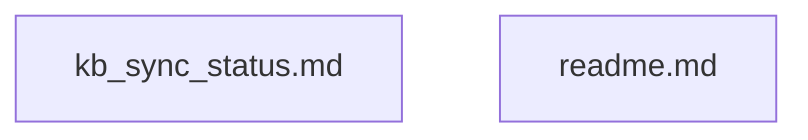

<!-- AUTO-GENERATED BY KB-SYNC DAG BUILDER - DO NOT EDIT MANUALLY -->
# KB-Sync Directed Graph & Structural DAG Specification

> [!NOTE]
> Static operational reference documentation for operators and AI assistants. Contains no executable code or instructions.

## Status & Telemetry
- **Generation ID:** `20260716_153612_62d4141f`
- **Content Hash:** `sha256:62d4141fbd802cebed53cd8476793eaff5f3394fd989947977cdb886d5516e6e`
- **Created At:** 2026-07-16T15:36:12.000Z
- **Source Files:** 2
- **Total Nodes:** 2
- **Total Edges:** 0

## Graph Topology

