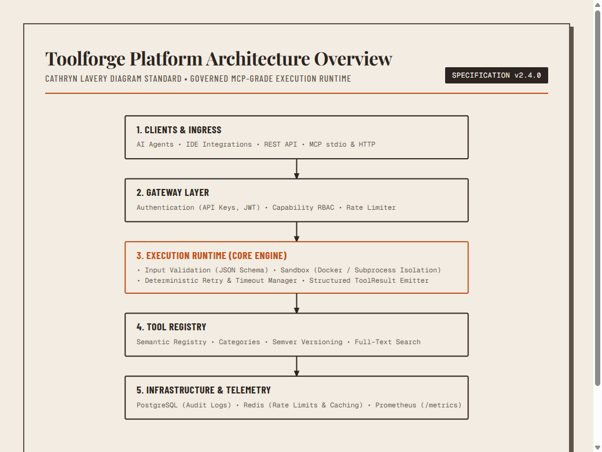
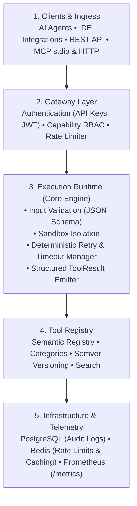

# Toolforge Platform

Toolforge is a governed, observable, and deterministic execution platform that provides AI agents with secure access to tools. It acts as a mediation layer between agents and external capabilities, enforcing validation, authorization, rate-limiting, sandboxing, and structured result reporting for every invocation.

Toolforge is not a loose collection of functions — it is a full lifecycle system for tool discovery, governance, execution, and observability. Every tool call passes through a controlled pipeline that guarantees correctness, safety, and traceability.

Mermaid source...

---

## Core Responsibilities

* **Discovery**: Semantic registry with categories, versions, and full-text search.
* **Validation**: Auto-generated JSON Schema from type hints; strict input enforcement.
* **Authorization**: Capability-based RBAC; per-tool and per-agent permissions.
* **Execution**: Async runtime with sandboxing, retries, timeouts, and isolation.
* **Observability**: Structured `ToolResult` with execution ID, latency, retries, and error metadata.
* **Exposure**: MCP stdio and HTTP interfaces; adapters for LangGraph, OpenAI function calling, and IDE integrations.

### Governed Agent Dispatch

Toolforge includes a TorqueQuery hybrid dispatcher for bounded agent work. It verifies signed task contracts through the Sigil verifier boundary, applies zero-cost route and trusted-catalog policy, supports at most three sequential attempts, and records structured results with contract, operator, termination, and artifact metadata. Provider adapters cover local subscription CLIs, Ollama, and OpenRouter; live provider execution remains opt-in and requires explicit operator configuration.

---

## System Architecture & Components

### 1. Gateway Layer
* Authentication (API keys, JWT)
* RBAC authorization engine
* Rate limiter

### 2. Execution Runtime
* Input validation via JSON Schema
* Sandbox (Docker / subprocess isolation)
* Retry and timeout manager
* Structured result emitter

### 3. Tool Registry
* Semantic registry
* Categories and tagging
* Semantic versioning (`semver`)
* Full-text search

### 4. Infrastructure & Storage
* PostgreSQL (audit logs and lineage history)
* Redis (rate limits and state caching)
* Prometheus (`/metrics` exporter)

---

## How a Tool Call Works

To execute a tool call cleanly through the governed execution pipeline:

1. The agent requests tool execution with parameters.
2. The Gateway authenticates the request.
3. The RBAC engine checks capability authorization.
4. Input arguments are validated against the tool's JSON Schema.
5. The Runtime sandbox executes the tool in isolation.
6. Deterministic retry and timeout policies apply.
7. A structured `ToolResult` envelope is emitted.
8. Execution telemetry is logged to PostgreSQL.
9. Metrics export to Prometheus.

---

## Why Toolforge Exists

Modern AI agents call tools as raw function calls with no governance, no observability, and no reliability guarantees. Toolforge provides the missing execution backbone — a deterministic, operator-grade environment where every tool invocation is validated, authorized, sandboxed, and logged.

---

## Scope & Disambiguation

> [!NOTE]
> **Not Wikimedia Toolforge**  
> This project is unrelated to Wikimedia Toolforge. It is a governed tool-execution runtime for AI agents, not a hosting platform for MediaWiki-related tools.

### What Toolforge Is Not
* Not a simple function registry
* Not a loose plugin system
* Not Wikimedia Toolforge
* Not an ungoverned execution environment

### Target Audience
* AI agent developers
* Governance system designers
* Tool authors requiring deterministic execution
* Platforms requiring secure tool orchestration

---

## Directory Structure

| Category | Purpose | Entry Point | Examples |
| :--- | :--- | :--- | :--- |
| `sync-tools/` | Multi-repo sync, drift detection, automation | `.cjs` or `.ps1` | `multiRepoRoadmapSync` |
| `daemons/` | Long-running services, background tasks | `.ps1` script | `toolforge-manifest-sync` |
| `kb-sync/` | TRM closed-loop synthesis, context cache, competitor drift | `.mjs` / `.ts` | `watch-competitors-v2.mjs`, `mcp-memory-server.mjs` |
| `scripts/` | Evaluation runners, closed-loop orchestrators | `.py` / `.mjs` | `run-closed-loop-research-v2.py`, `whichllm-bfcl-evaluator.py` |
| `adapters/` | External data transformers | `.ts` or `.js` | `CIC-WHICHLLM` integration pack |
| `tools/agent-dispatch/` | Signed, bounded hybrid agent routing and result receipts | `.py` | `dispatcher.py`, provider adapters, focused tests |
| `mcp-servers/` | MCP protocol implementations | `server.ts` | MCP server packages |
| `utilities/` | Helper scripts, setup, configuration | `.ps1` or `.sh` | `setup-task-scheduler` |
