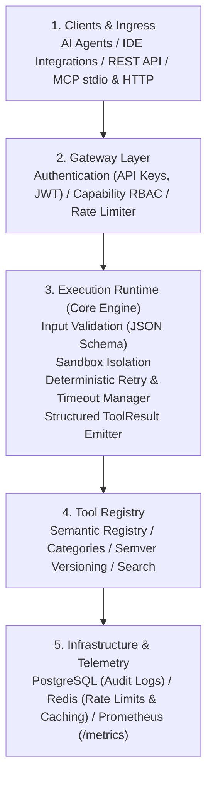

# Toolforge Platform

Toolforge is a governed, observable, and deterministic execution platform that gives AI agents secure access to tools. It sits between agents and external capabilities, enforcing validation, authorization, rate-limiting, sandboxing, and structured result reporting for every invocation.

Toolforge is not a loose bag of functions - it is a full lifecycle system for tool discovery, governance, execution, and observability. Every tool call is meant to pass through a controlled pipeline so you get correctness, safety, and traceability.

**Workspace root**: `C:\dev`. There is no `C:\dev\toolforge` directory on this machine; treat `C:\dev` as the Toolforge repo root (`manifest.json`, skills, utilities, and these docs live here).


<details>
<summary>Mermaid source...</summary>


</details>

---

## Start here

Friendly on-ramps for day-to-day work (skills-first):

| I want to... | Open this |
| --- | --- |
| Find docs that actually exist on disk | [docs/DOCS_INDEX.md](docs/DOCS_INDEX.md) |
| Run / list / inspect capabilities (operator) | [OPERATOR_GUIDE.md](OPERATOR_GUIDE.md) |
| Author or update skill docs the standard way | [docs/meta/skill-operator-guide.md](docs/meta/skill-operator-guide.md) |
| Launch skills from the live manifest | [`utilities\run-tool.ps1`](utilities/run-tool.ps1) (`-ListOnly` to list) |
| Create a new skill or classic tool | [TOOL_CREATION_GUIDE.md](TOOL_CREATION_GUIDE.md) |
| Naming / versioning / lifecycle rules | [GOVERNANCE.md](GOVERNANCE.md) |

Quick launcher:

```text
cd C:\dev
.\utilities\run-tool.ps1 -ListOnly
.\utilities\run-tool.ps1
```

`utilities\run-tool.ps1` reads active skills from `C:\dev\manifest.json` and resolves them under `C:\dev\skills\<id>`.

---

## Core Responsibilities

* **Discovery**: Semantic registry with categories, versions, and search (skills in `manifest.json` today).
* **Validation**: Schema / skill-doc checks; strict inputs where wired.
* **Authorization**: Capability-based RBAC; per-tool and per-agent permissions (platform design).
* **Execution**: Runtime with sandboxing, retries, timeouts, and isolation where enabled.
* **Observability**: Structured results with execution metadata where emitters are wired.
* **Exposure**: MCP / HTTP / IDE adapter surfaces as the platform grows - do not assume every interface folder exists on disk yet.

---

## System Architecture & Components

### 1. Gateway Layer
* Authentication (API keys, JWT)
* RBAC authorization engine
* Rate limiter

### 2. Execution Runtime
* Input validation via JSON Schema
* Sandbox (Docker / subprocess isolation)
* Retry and timeout manager
* Structured result emitter

### 3. Tool Registry
* Semantic registry
* Categories and tagging
* Semantic versioning (`semver`)
* Full-text search

### 4. Infrastructure & Storage
* PostgreSQL (audit logs and lineage history)
* Redis (rate limits and state caching)
* Prometheus (`/metrics` exporter)

---

## How a Tool Call Works

To execute a tool call cleanly through the governed execution pipeline:

1. The agent requests tool execution with parameters.
2. The Gateway authenticates the request.
3. The RBAC engine checks capability authorization.
4. Input arguments are validated against the tool's JSON Schema.
5. The Runtime sandbox executes the tool in isolation.
6. Deterministic retry and timeout policies apply.
7. A structured `ToolResult` envelope is emitted.
8. Execution telemetry is logged to PostgreSQL.
9. Metrics export to Prometheus.

Day-to-day on this workstation, operators more often list and run **skills** via `utilities\run-tool.ps1` against `manifest.json` + `skills\`.

---

## Why Toolforge Exists

Modern AI agents call tools as raw function calls with no governance, no observability, and no reliability guarantees. Toolforge provides the missing execution backbone - a deterministic, operator-grade environment where every tool invocation is validated, authorized, sandboxed, and logged.

---

## Scope & Disambiguation

> [!NOTE]
> **Not Wikimedia Toolforge**  
> This project is unrelated to Wikimedia Toolforge. It is a governed tool-execution runtime for AI agents, not a hosting platform for MediaWiki-related tools.

### What Toolforge Is Not
* Not a simple function registry
* Not a loose plugin system
* Not Wikimedia Toolforge
* Not an ungoverned execution environment

### Target Audience
* AI agent developers
* Governance system designers
* Tool authors requiring deterministic execution
* Platforms requiring secure tool orchestration

---

## Directory Structure (honest, on this machine)

| Path | Purpose | Status on disk |
| :--- | :--- | :--- |
| `skills/` | **Primary** reusable automation units (`SKILL.md`, `README.md`, `docs/USAGE.md`, `src/`) | Present - dozens of skill folders; registry in `manifest.json` (~51 active) |
| `sync-tools/` | Multi-repo sync, drift detection, automation scripts | Present (classic) |
| `daemons/` | Scheduled / background Task Scheduler scripts | Present (classic) |
| `utilities/` | Helper scripts, including `run-tool.ps1` and skill validators | Present (classic) |
| `docs/` | Working documentation hub (`docs/DOCS_INDEX.md`) | Present |
| `kb-sync/` | KB sync / research helpers | Present (supporting) |
| `scripts/` | Evaluation runners / orchestrators | Present (supporting) |
| `adapters/` | External data transformers | **Reserved / empty** - folder not present |
| `mcp-servers/` | MCP protocol packages | **Reserved / empty** - folder not present |
| `scaffolds/` | Template generators | **Reserved / empty** - folder not present |
| `prototypes/` | Experimental drop zone | **Reserved / empty** - folder not present |

Do not treat reserved rows as create-here-now paths. New work defaults to `skills\<id>` - see [TOOL_CREATION_GUIDE.md](TOOL_CREATION_GUIDE.md).

---

## Ecosystem Provenance & Attribution

Toolforge operates as an integration, governance, and execution mediation platform. To keep open-source attribution clear, the taxonomy below outlines native systems versus wrapped third-party projects:

### 1. First-Party Native Subsystems
* **Sigil**: Canonical inter-agent communication, relay directory, and task federation runtime authored natively by Toolforge / CIC-Rewrite Labs.
* **IronLedger**: Deterministic financial reconciliation and immutable ledger pipeline.
* **Delivery Guard**: Reusable release governance and merge barrier engine.

### 2. Integrated & Wrapped Third-Party Tools
* **WhichLLM**: External LLM benchmark and routing engine. Wrapped via CIC WhichLLM integration with lineage validation and governance gates.
* **KarpathyLLM**: Educational and reference minimal LLM architectures (e.g. `llm.c` / `nanoGPT` by Andrej Karpathy). Embedded as local benchmarking and tokenizer validation test harnesses.
* **BrowserOS-Neo**: Headless browser automation runtime. Integrated as an MCP-oriented surface with session lifecycle safety guards.
* **GBrain**: Semantic codebase indexer and AST caller graph (from `gstack`). Integrated for multi-agent knowledge resolution.
* **TinyFish**: Web search and structured page extraction agent. Wrapped with timeout and caching guards.
* **Parallel**: Deep web research and data enrichment CLI/API. Wrapped via `parallel-*` execution skills.
* **Graft**: Git-synced codebase knowledge graph. Integrated for fast token-budgeted symbol and caller resolution.

---

*Home refresh aligned to live `C:\dev` layout on 2026-09-07. Previous copy preserved as `Home.md.bak`.*
