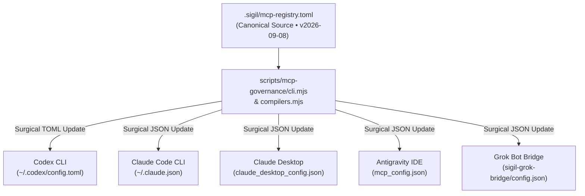

# Unified Multi-Client MCP Governance & Profile-Based Context Optimization

This document outlines the architecture, data structures, compilation pipelines, and operational commands for the unified Model Context Protocol (MCP) governance framework.

---

## 1. System Architecture & Topology

The MCP governance framework centralizes MCP server cataloging and token budget enforcement into a single canonical source of truth (`.sigil/mcp-registry.toml`), compiled into client-specific configurations via deterministic, AST-safe compilers.



<details>
<summary>Mermaid source...</summary>


</details>

---

## 2. Profile Manifest & Budget Enforcement

Every client profile defines strict ceiling limits on both tool counts and serialized JSON schema tokens. Exact token weights are validated using `js-tiktoken` (`cl100k_base` encoding).

### Profile Manifest Summary

| Client | Configuration Path | Active Profile | Tools | Schema Tokens | Max Budget (Tok/Tool) | Headroom |
|---|---|---|---|---|---|---|
| **Codex CLI** | `~/.codex/config.toml` | `dev` | 3 | 3,300 | 12,000 / 12 | +8,700 |
| **Claude CLI** | `~/.claude.json` | `dev` | 3 | 3,300 | 12,000 / 12 | +8,700 |
| **Claude Desktop** | `%APPDATA%/Claude/claude_desktop_config.json` | `full` | 6 | 19,300 | 45,000 / 50 | +25,700 |
| **Antigravity** | `~/.gemini/antigravity/mcp_config.json` | `full` | 6 | 19,300 | 45,000 / 50 | +25,700 |
| **Grok** | `C:/dev/sigil-repo/modules/grok-bridge/config.json` | `dev-minimal` | 2 | 1,800 | 5,000 / 6 | +3,200 |

---

## 3. AST-Safe Surgical Compilers & Atomic Writers

To eliminate configuration file corruption and preserve user comments, telemetry, model settings, and non-MCP tables:

1. **Surgical AST Replacement**:
   - TOML targets: Isolates and updates `[mcp_servers]` and `[mcp_servers.*]` blocks while preserving comments, scalar keys, and non-MCP tables (`[plugins]`, `[memories]`).
   - JSON targets: Detects user indentation (2-space, 4-space, tabs) and updates `mcpServers` without altering top-level metadata.
2. **Atomic Write Pipeline**:
   - Creates an immediate pre-modification backup copy at `<file>.bak`.
   - Writes generated content to a unique temporary file (`<file>.tmp.<timestamp>_<rand>`).
   - Executes atomic swap via `fs.renameSync`.
   - Restores original `<file>.bak` and throws `ERR_ATOMIC_WRITE_FAILURE` (exit code `30`) if write fails.

---

## 4. Deterministic Error Codes

All CLI operations yield stable numeric exit codes for scriptable automation:

| Exit Code | Constant | Description |
|---|---|---|
| `0` | `SUCCESS` | Completed cleanly with all budgets verified. |
| `10` | `ERR_BUDGET_VIOLATION` | Profile exceeds `max_tools` or `max_schema_tokens`. |
| `20` | `ERR_AST_PARSE_FAILURE` | Syntax or parser error in TOML/JSON configuration. |
| `30` | `ERR_ATOMIC_WRITE_FAILURE` | File rename or atomic write failed; restored from `.bak`. |
| `40` | `ERR_CLIENT_CONFIG_INVALID` | Client configuration path missing or root object invalid. |
| `50` | `ERR_REGISTRY_SCHEMA_INVALID` | Missing required fields, version mismatch, or unresolved server. |

---

## 5. CLI Usage & Operator Guide

```powershell
# 1. View live profile manifest dashboard
node scripts/mcp-governance/cli.mjs status

# 2. Validate canonical registry budgets
node scripts/mcp-governance/cli.mjs validate

# 3. Preview configuration changes without touching disk
node scripts/mcp-governance/cli.mjs sync --dry-run

# 4. Synchronize all client configurations
node scripts/mcp-governance/cli.mjs sync

# 5. Switch profile for a single client
node scripts/mcp-governance/cli.mjs profile set codex research
node scripts/mcp-governance/cli.mjs sync --client=codex
```

