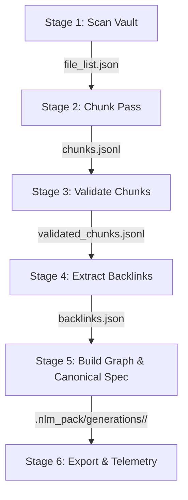

# KB-Sync Directed Graph & Structural DAG Design Specification

**Status:** APPROVED  
**Date:** August 8, 2026  
**Target Path:** `docs/meta/specs/2026-08-08-kb-sync-dag-design.md`  
**Governing Subsystem:** `kb-sync` (Toolforge / CIC Monorepo)

---

## 1. Executive Summary & Goal

This specification details the architecture, schemas, atomic commit protocol, and verification suite for integrating a machine-readable Directed Graph / Structural DAG into the `kb-sync` pipeline (`C:\dev`).

### Key Objectives:
1. **Machine-Readable Topology:** Serialize `dag.json` and `adjacency.json` into runtime generation directories for $O(1)$ graph traversal by Claude & CLI tools.
2. **Canonical Spec Generation:** Maintain [`C:\dev\docs\KB_SYNC_DAG.md`](file:///c:/dev/docs/KB_SYNC_DAG.md) in git as the human/agent-readable reference doc.
3. **Crash Consistency & Determinism:** Implement generation directory isolation (`.nlm_pack/generations/<gen_id>/`), atomic pointer swaps, and 100% bit-identical content hashing across repeat runs.
4. **Non-Breaking Integration:** Preserve existing `package.json` commands without altering existing sync behavior.

---

## 2. Repository Ownership & Commands

### 2.1 Workspace Root
* **Root Location:** Always `C:\dev` (resolved by locating `package.json` with `"name": "toolforge-marketplace"`).

### 2.2 Package Integration ([`c:\dev\package.json`](file:///c:/dev/package.json))
Add explicit, non-breaking CLI scripts:
```json
"scripts": {
  "kb:status": "node kb-sync/scripts/check-status.mjs",
  "kb:sync:status": "node kb-sync/scripts/check-status.mjs",
  "kb:dag": "node kb-sync/scripts/build-dag.mjs",
  "kb:dag:check": "node kb-sync/scripts/build-dag.mjs --check-only",
  "kb:dag:recover": "node kb-sync/scripts/build-dag.mjs --recover"
}
```

### 2.3 CLI Flags & Execution Modes
* **`npm run kb:dag` (Normal Build):** Executes health check → auto-recovers if corrupt → builds a new generation → updates docs & pointer.
* **`npm run kb:dag:check` (`--check-only`):** **Strictly READ-ONLY**. Validates pointer, hashes, schemas, and `docs/KB_SYNC_DAG.md`. Exits `0` if healthy, `1` if unhealthy. Zero disk writes or mutations.
* **`npm run kb:dag:recover` (`--recover`):** Manually triggers the same recovery scan and validation used by normal auto-recovery, adopts the latest valid generation, heals `docs/KB_SYNC_DAG.md` and pointer, then **exits immediately without running a new build**. Normal `npm run kb:dag` performs that recovery step only when health checks detect an invalid or missing active state, then continues with a fresh build; `--recover` stops after adoption and healing.

---

## 3. Multi-Pass Pipeline Stage Sequence

Backlink extraction occurs **before** DAG construction so cross-references serve as graph inputs:



1. **Stage 1 (Scan):** `scan-vault.mjs` → `file_list.json`
2. **Stage 2 (Chunk):** `chunk-pass.mjs` → `chunks.jsonl`
3. **Stage 3 (Validate):** `validate-chunks.mjs` → `validated_chunks.jsonl`
4. **Stage 4 (Extract Backlinks):** `extract-backlinks.mjs` → `backlinks.json`
5. **Stage 5 (Build DAG & Canonical Spec - NEW):** `kb-sync/scripts/build-dag.mjs` (invoking `kb-sync/core/dag.mjs`) → produces `dag.json`, `adjacency.json`, and updates `docs/KB_SYNC_DAG.md`.
6. **Stage 6 (Export & Telemetry):** `consolidate-pack.mjs` & `check-status.mjs` → telemetry update.

---

## 4. Graph Semantics & Normalization

### 4.1 Graph Classification
* **Structural Hierarchy (`File -> Chunk`):** Strictly an **acyclic DAG**.
* **Cross-Reference Network (`wikilink`, `mdlink`, `mention`):** A **Directed Graph** permitting valid cycles.

### 4.2 Link & Tag Normalization
* **Links:** Relative Markdown links (`[text](./docs/../foo.md)`), root links (`/foo.md`), and Obsidian wikilinks (`[[foo]]`) normalize to lowercase, forward-slash, root-relative paths: `foo.md`.
* **Tags:** Lowercased, stripped of leading `#`, trimmed, deduplicated, and sorted lexicographically.
* **Heading Slugs:** Lowercase GitHub-style slug (`setup`). Sibling duplicate slugs in the same file append line number (`setup_L42`).

### 4.3 Diagnostic Classification
* **Malformed Link (Syntax Error):** e.g., `[[unclosed_link`. Logged to `.validation-report.json` under `MALFORMED_LINK_SYNTAX`. No node created.
* **Dangling Reference (Missing Target):** e.g., `[[NonExistentPage]]`. Creates a node with `id: "node:file:missing-page.md"`, `node_type: "dangling"`, `target_kind: "file"|"chunk"|"external"`, `status: "missing"`.

---

## 5. Crash-Consistent Atomic Commit & Recovery Protocol

### 5.1 Generation Directory Isolation
Every build writes into `.nlm_pack/generations/<generation_id>/` where `<generation_id>` is `YYYYMMDD_HHMMSS_<content_hash_8>`.

### 5.2 Commit Protocol
1. **Build Generation:** Write `dag.json`, `adjacency.json`, `KB_SYNC_DAG.md`, and `manifest.json` (containing SHA-256 signatures).
2. **Atomic Doc Update:** Copy `KB_SYNC_DAG.md` to `C:\dev\docs\KB_SYNC_DAG.tmp.md` → flush to disk → atomically rename to `C:\dev\docs\KB_SYNC_DAG.md`.
3. **Atomic Pointer Swap:** Write `.nlm_pack/current_generation.tmp.json` → flush to disk → atomically rename to `.nlm_pack/current_generation.json`.

### 5.3 Recovery Scan & Winner Selection Algorithm
Triggered when pointer is missing/invalid or `--recover` is invoked:
1. Scan `.nlm_pack/generations/` sorted descending by timestamp (**newest → oldest**).
2. Skip missing/unreadable `manifest.json` files without throwing exceptions.
3. Candidate directory wins IF AND ONLY IF:
   - `manifest.json` exists and parses cleanly.
   - `dag.json` and `adjacency.json` match `manifest.json` SHA-256 and pass JSON Schema validation.
   - `KB_SYNC_DAG.md` matches `manifest.json` SHA-256.
4. The first candidate passing all checks wins. Heal `docs/KB_SYNC_DAG.md` and pointer atomically.

### 5.4 Garbage Collection (GC) & Concurrency Lock
* Acquire `.nlm_pack/gc.lock` before GC execution.
* **Always Retain:** The generation currently referenced in `current_generation.json` (even if ranked 4th-or-older by recency).
* **Retain Top 3:** The 3 most recent valid generation directories (excluding active gen).
* **Purge All Else:** Delete all older or incomplete generations.

## 6. Data Schemas & Formal Constraints (`version: "2.0.0"`)

### 6.1 Schema Artifact File Paths
* **DAG Schema:** [`C:\dev\kb-sync\schemas\dag.schema.v2.json`](file:///c:/dev/kb-sync/schemas/dag.schema.v2.json)
* **Adjacency Schema:** [`C:\dev\kb-sync\schemas\adjacency.schema.v2.json`](file:///c:/dev/kb-sync/schemas/adjacency.schema.v2.json)

### 6.2 Formal Rules & Constraints (`dag.schema.v2.json`)
* **Top-Level Required Keys:** `["$schema", "version", "metadata", "nodes", "edges"]`
* **Metadata Required Keys:** `["content_hash", "created_at", "source_file_count", "total_nodes", "total_edges", "cycles_count", "generation_id"]`
* **Node Object Constraint:**
  * `required`: `["id", "node_type", "label", "path", "status", "target_kind", "tags"]`
  * `node_type` Enum: `"file" | "chunk" | "dangling"`
  * `status` Enum: `"valid" | "missing" | "stale"`
  * `target_kind` Enum: `"file" | "chunk" | "external"`
  * `additionalProperties`: `false` (except optional `anchor` and `line_number` when `node_type == "chunk"`)
  * `id` Uniqueness: All `nodes[*].id` values must be strictly unique.
* **Edge Object Constraint:**
  * `required`: `["id", "source", "target", "relation"]`
  * `relation` Enum: `"contains" | "wikilink" | "mdlink" | "mention"`
  * `additionalProperties`: `false`
  * `id` Uniqueness: All `edges[*].id` values must be strictly unique.

```json
{
  "$schema": "https://json-schema.org/draft/2020-12/schema",
  "version": "2.0.0",
  "metadata": {
    "content_hash": "sha256:a1b2c3d4e5f67890",
    "created_at": "2026-08-08T07:00:00.000Z",
    "cycles_count": 3,
    "generation_id": "20260808_070000_a1b2c3d4",
    "source_file_count": 240,
    "total_edges": 620,
    "total_nodes": 450
  },
  "nodes": [
    {
      "anchor": "setup",
      "id": "node:chunk:docs/readme.md#setup",
      "label": "Setup Guide",
      "line_number": 25,
      "node_type": "chunk",
      "path": "docs/readme.md",
      "status": "valid",
      "tags": ["setup"],
      "target_kind": "chunk"
    }
  ],
  "edges": [
    {
      "id": "edge:node:file:docs/readme.md->node:chunk:docs/readme.md#setup:contains",
      "relation": "contains",
      "source": "node:file:docs/readme.md",
      "target": "node:chunk:docs/readme.md#setup"
    }
  ]
}
```

### 6.3 Formal Rules & Constraints (`adjacency.schema.v2.json`)
* **Complete $O(1)$ Node Coverage:** **Every** node in `dag.json` MUST have a key in both `forward` and `reverse` maps, even if its list is empty `[]`.
* **Required Keys:** `["version", "forward", "reverse"]`
* **SemVer Match Rule:** Readers validating `version` require major version `2`.

```json
{
  "version": "2.0.0",
  "forward": {
    "node:file:docs/readme.md": [
      { "relation": "contains", "target": "node:chunk:docs/readme.md#setup" }
    ],
    "node:file:missing-page.md": []
  },
  "reverse": {
    "node:file:docs/readme.md": [],
    "node:file:missing-page.md": [
      { "relation": "wikilink", "source": "node:chunk:docs/readme.md#setup" }
    ]
  }
}
```

---

## 7. Canonical Specification Template ([`docs/KB_SYNC_DAG.md`](file:///c:/dev/docs/KB_SYNC_DAG.md))

* **Header Guard:** `<!-- AUTO-GENERATED BY KB-SYNC DAG BUILDER - DO NOT EDIT MANUALLY -->`
* **Static Guidance Banner:**  
  `> [!NOTE]`  
  `> Static operational reference documentation for operators and AI assistants. Contains no executable code or instructions.`
* **Mermaid Stability Cap:** Renders core hierarchy up to 50 nodes max. If total nodes > 50, renders collapsed folder view with link to `dag.json`.

---

## 8. Verification & Test Plan ([`kb-sync/tests/dag-builder.test.mjs`](file:///c:/dev/kb-sync/tests/dag-builder.test.mjs))

1. **`L12: 🔴 test: Determinism`** — Verify bit-identical `content_hash`, `nodes`, `edges`, and `adjacency.json` across repeat runs on unchanged files.
2. **`L35: 🔴 test: Read-Only Check`** — Execute `npm run kb:dag:check` on healthy and corrupt workspaces. Assert zero disk writes or file mutations.
3. **`L58: 🔴 test: JSON Schema Validation`** — Validate generated `dag.json` and `adjacency.json` against `kb-sync/schemas/dag.schema.v2.json` and `adjacency.schema.v2.json`.
4. **`L80: 🔴 test: Atomic Rollback & State Validation`** — Simulate crash during pointer swap. Assert existing files, pointer, and artifact schemas remain 100% valid.
5. **`L92: 🔴 test: Self-Healing Forward Mismatch`** — Simulate crash between Step 2 (doc rename) and Step 3 (pointer swap). Run `npm run kb:dag:check`. Assert health check flags doc-vs-pointer hash mismatch, recovery scan adopts newest valid generation (Gen N), updates pointer, and self-heals forward without data loss.
6. **`L110: 🔴 test: Recovery & Self-Healing`** — Delete `current_generation.json` and corrupt `docs/KB_SYNC_DAG.md`. Run `npm run kb:dag:recover`. Assert newest valid generation adopted and doc healed.
7. **`L135: 🔴 test: GC Retention with Stale Active Pointer`** — Set active pointer to a generation ranked 5th by recency. Run GC. Assert 4 total generations retained: the active generation plus the 3 most recent valid generations; only the remaining older generation is purged.
