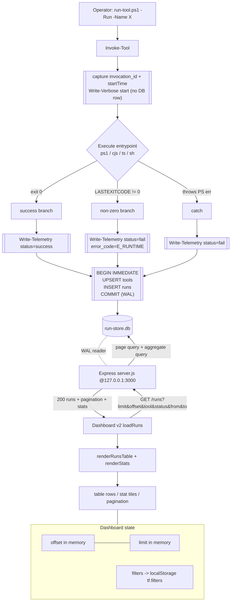

# Toolforge Phase 2b — Step 1 Architecture (DESIGN_LOCKED)

This is the authoritative build contract for **Step 1**. A builder agent implements each
file mechanically from this document with **zero remaining architectural judgment calls**.
Where this document and `toolforge-phase-2b-implementation-plan.md` disagree, **this document
wins** for Step 1. All disagreements are listed in §0.2 with rationale.

Absolute paths only (per project convention). Windows / PowerShell 7 host.

---

## 0. Overview + Corrections to the Plan

### 0.1 Component map (Step 1 files)

| # | File (absolute) | Purpose | Depends on |
|---|-----------------|---------|-----------|
| F1 | `C:\dev\toolforge\schema.sql` | Canonical DDL (source of truth) | — |
| F2 | `C:\dev\toolforge\utilities\init-run-store.ps1` | Create/migrate `run-store.db`, enable WAL | F1 |
| F3 | `C:\dev\toolforge\run-tool.ps1` (MODIFY) | Emit telemetry around `Invoke-Tool` | F2, run-store.db |
| F4 | `C:\dev\toolforge\api\telemetry\server.js` | Express read API | run-store.db |
| F5 | `C:\dev\toolforge\api\telemetry\package.json` | Node deps | — |
| F6 | `C:\dev\toolforge\api\telemetry\.env.example` | Config template (no secrets) | — |
| F7 | `C:\dev\toolforge\dashboard-v2.html` | 5-tab shell, History tab live | F8, F9 |
| F8 | `C:\dev\toolforge\assets\cic-dashboard.css` | Cast Iron Charlie styles | — |
| F9 | `C:\dev\toolforge\assets\dashboard-v2.js` | Fetch/render/filter/paginate | F4, F7 |

Out of scope for Step 1 (deferred): `errors` table population, `alerts`, error taxonomy,
badges, release automation, auto-poll intervals >0. The `errors`/`alerts` DDL is created in
Step 1 (cheap, forward-compatible) but **not written to**.

### 0.2 Corrections to the implementation plan (binding)

These are real defects in the plan. The builder MUST follow the corrected design below.

| ID | Plan defect | Correction (this doc) |
|----|-------------|-----------------------|
| C1 | Plan treats `$Run` as the tool-name string and wraps `& ".\tools\$Run\run.ps1"`. | **Actual** `run-tool.ps1`: `$Run` is a `[switch]`; tool name is `$Name`; execution is in `Invoke-Tool` via the manifest. Hook goes **inside `Invoke-Tool`** using `$Name`. See §4.1. |
| C2 | Plan writes a `start` telemetry row **and** a `success`/`fail` row, both `INSERT` with the same `invocation_id` (PRIMARY KEY) → second insert throws `UNIQUE constraint`. | **Single authoritative write at completion.** Start is emitted to console/verbose only (no DB row). See §1.4 + §5.1. |
| C3 | Plan's `Write-Telemetry` sets `status = 'fail'` for any non-`success` event (so a `start` event would be `fail`). | Eliminated by C2 (only `success`/`fail` are ever written). CHECK constraint enforces the enum. |
| C4 | Plan's outer `try/catch` cannot catch native-tool failures because `Invoke-Tool` calls `exit $LASTEXITCODE`. | Telemetry is written **before** each `exit` inside `Invoke-Tool`, and covers both PS exceptions and non-zero `$LASTEXITCODE`. See §4.1. |
| C5 | `runs.tool` has `FOREIGN KEY → tools(name)` but nothing populates `tools`; with `PRAGMA foreign_keys=ON` the run insert fails. | Telemetry hook **UPSERTs `tools(name,last_run)`** in the same transaction before inserting the run. `foreign_keys=ON` everywhere. See §1.2 + §4.1. |
| C6 | `tools.success_count / fail_count / avg_duration_ms` implied maintained; running-average denormalization drifts. | Columns retained for forward-compat but **NOT written in Step 1**. All counts/rates/averages computed **live from `runs`**. Single source of truth. |
| C7 | Dashboard `updateStats()` aggregates only the current 20-row page while labelled "(24h)". | Stats come from the **server**, computed over the full filtered set (ignoring limit/offset). Labels are **dynamic** (reflect the active filter window), not a hard-coded "24h". See §2.3 + §3.4. |
| C8 | API `res.status(500).json({ error: err.message })` leaks internal errors to clients. | Central error envelope `{ error: { code, message } }`; 500s log server-side and return a generic message. See §2.5. |
| C9 | No pagination `total`; dashboard "Next" increments blindly past the last page. | `runs` response returns `pagination.total` + `hasNext`/`hasPrev`; client disables buttons at bounds. See §2.2 + §3.5. |
| C10 | CIC hex codes in the plan CSS are off (`--ember:#D85A24`, `--black:#0d0b08`). | Use **canonical** CIC palette (§3.3). `--ember:#C4501A`, `--black:#0a0806`, etc. |
| C11 | No CORS; dashboard (file:// or static-served) is a cross-origin caller to `localhost:3000`. | Explicit CORS allowing loopback origins + `null` (file://), GET only; server binds to `127.0.0.1`. See §2.4. |
| C12 | `.env` committed with an absolute `DB_PATH`. | Ship `.env.example` only; `DB_PATH` derived from `__dirname` in code; `.env` git-ignored. See §2.6. |

### 0.3 Locked cross-cutting decisions (one line each)

- **Write model:** single synchronous write at tool completion (§5.1).
- **Timestamps:** UTC ISO-8601 with milliseconds, `o` format (`2026-07-11T14:03:22.104Z`). Lexicographic sort == chronological sort. All comparisons string-based.
- **Duration unit:** integer milliseconds (`duration_ms`), rounded.
- **Status enum:** `'success' | 'fail'` (Step 1). `'running'` reserved, not used.
- **PK:** `invocation_id` = lowercase UUID v4 string.
- **API is read-only.** No write endpoints. Bound to `127.0.0.1`.
- **Default page size:** 25. Selectable 25 / 50 / 100. Hard cap 100.
- **Refresh:** manual button + optional auto-poll (default OFF, 30 s when ON) (§5.4).

---

## 1. SQLite Schema + Migration Strategy (`run-store.db`)

### 1.1 Database file + PRAGMAs

- **DB file:** `C:\dev\toolforge\run-store.db`
- **Journal mode:** `WAL` — set once at init; **persisted in the DB header** (survives reopen).
- **Per-connection PRAGMAs** (set by every connection, PS hook and Node alike):
  - `PRAGMA foreign_keys = ON;`
  - `PRAGMA busy_timeout = 5000;` (5 s wait on lock instead of immediate `SQLITE_BUSY`)
  - `PRAGMA synchronous = NORMAL;` (WAL-safe; durable across app crash, fast)

WAL permits one writer + many concurrent readers, which is exactly the topology here
(PowerShell writes; Node/dashboard read).

### 1.2 Canonical DDL — `C:\dev\toolforge\schema.sql`

This file is the single source of truth. `init-run-store.ps1` executes it verbatim. Uses
`IF NOT EXISTS` so it is **idempotent** (safe to re-run; never drops data).

```sql
-- ============================================================
-- Toolforge run-store.db — Phase 2b Step 1 schema
-- Idempotent. Safe to re-run. UTC ISO-8601 timestamps ('o').
-- ============================================================

-- runs: one authoritative row per completed tool invocation
CREATE TABLE IF NOT EXISTS runs (
  invocation_id  TEXT    PRIMARY KEY NOT NULL,          -- UUID v4 (lowercase)
  tool           TEXT    NOT NULL,                      -- FK -> tools(name)
  timestamp      TEXT    NOT NULL,                      -- ISO-8601 UTC, completion time
  duration_ms    INTEGER NOT NULL DEFAULT 0,            -- wall-clock ms, >= 0
  status         TEXT    NOT NULL,                      -- 'success' | 'fail'
  error_code     TEXT,                                  -- NULL on success; 'E_RUNTIME' etc on fail
  error_message  TEXT,                                  -- NULL on success
  version        TEXT,                                  -- semver of the tool, nullable
  CONSTRAINT chk_runs_status   CHECK (status IN ('success','fail')),
  CONSTRAINT chk_runs_duration CHECK (duration_ms >= 0),
  FOREIGN KEY (tool) REFERENCES tools(name)
);

CREATE INDEX IF NOT EXISTS idx_runs_timestamp        ON runs(timestamp DESC);
CREATE INDEX IF NOT EXISTS idx_runs_tool_timestamp   ON runs(tool, timestamp DESC);
CREATE INDEX IF NOT EXISTS idx_runs_status_timestamp ON runs(status, timestamp DESC);

-- tools: tool registry. Populated by UPSERT from the telemetry hook.
-- success_count/fail_count/avg_duration_ms are RESERVED (not written in Step 1;
-- stats are computed live from runs). Kept for forward-compat.
CREATE TABLE IF NOT EXISTS tools (
  name            TEXT    PRIMARY KEY NOT NULL,
  category        TEXT,
  version         TEXT,
  first_seen      TEXT,                                 -- ISO-8601 UTC, set once on insert
  last_run        TEXT,                                 -- ISO-8601 UTC, updated every run
  success_count   INTEGER DEFAULT 0,                    -- RESERVED (unused Step 1)
  fail_count      INTEGER DEFAULT 0,                    -- RESERVED (unused Step 1)
  avg_duration_ms REAL                                  -- RESERVED (unused Step 1)
);

-- ---- Step 2 forward-compat (created, NOT written in Step 1) ----
CREATE TABLE IF NOT EXISTS errors (
  error_id       TEXT PRIMARY KEY NOT NULL,
  invocation_id  TEXT NOT NULL,
  tool           TEXT NOT NULL,
  timestamp      TEXT NOT NULL,
  error_code     TEXT NOT NULL,
  error_message  TEXT,
  stack_trace    TEXT,
  FOREIGN KEY (invocation_id) REFERENCES runs(invocation_id),
  FOREIGN KEY (tool)          REFERENCES tools(name)
);
CREATE INDEX IF NOT EXISTS idx_errors_tool_timestamp ON errors(tool, timestamp DESC);
CREATE INDEX IF NOT EXISTS idx_errors_error_code     ON errors(error_code);

CREATE TABLE IF NOT EXISTS alerts (
  alert_id        TEXT PRIMARY KEY NOT NULL,
  tool            TEXT NOT NULL,
  timestamp       TEXT NOT NULL,
  alert_type      TEXT NOT NULL,
  threshold_value REAL NOT NULL,
  actual_value    REAL NOT NULL,
  status          TEXT NOT NULL,
  FOREIGN KEY (tool) REFERENCES tools(name)
);
CREATE INDEX IF NOT EXISTS idx_alerts_tool_timestamp ON alerts(tool, timestamp DESC);
```

**Table-creation order matters** for FK resolution when `foreign_keys=ON`: SQLite tolerates
forward references at `CREATE` time, but to be safe the DDL above declares `runs` before
`tools` yet SQLite resolves FKs lazily — acceptable. (If a strict engine complains, the
builder may reorder `tools` before `runs`; both orders are functionally correct because
FK checks fire on row insert, not table create.)

### 1.3 Migration strategy — `init-run-store.ps1`

**Location:** `C:\dev\toolforge\utilities\init-run-store.ps1`

Behavior (deterministic):
1. Resolve `$DbPath` (param, default `C:\dev\toolforge\run-store.db`) and
   `$SchemaPath = C:\dev\toolforge\schema.sql`.
2. If DB exists → copy to `run-store-backup-<yyyyMMdd-HHmmss>.db` (24-hour clock `HH`, not `hh`).
3. Open connection (via **PSSQLite**, see §1.5).
4. `PRAGMA journal_mode=WAL;` then `PRAGMA foreign_keys=ON;`
5. Execute `schema.sql` (idempotent `IF NOT EXISTS`).
6. Verify: `SELECT name FROM sqlite_master WHERE type='table' ORDER BY name;` must return
   `alerts, errors, runs, tools`. Print result; exit non-zero if any missing.
7. Close.

Because the DDL is idempotent, this script doubles as the forward migration for Step 2+
(just append new `CREATE ... IF NOT EXISTS` / `ALTER TABLE` blocks to `schema.sql`). No
migration framework needed at this scale; version the schema by a comment header.

### 1.4 Atomic write guarantee (transaction scope)

Each telemetry write is a **single transaction** wrapping two statements (tools upsert +
run insert). Either both land or neither does — no orphan run without a tool row, no partial
state. Concrete SQL executed by the hook (parameterized):

```sql
BEGIN IMMEDIATE;

INSERT INTO tools (name, first_seen, last_run)
VALUES (@tool, @ts, @ts)
ON CONFLICT(name) DO UPDATE SET last_run = @ts;

INSERT INTO runs
  (invocation_id, tool, timestamp, duration_ms, status, error_code, error_message, version)
VALUES
  (@invocation_id, @tool, @ts, @duration_ms, @status, @error_code, @error_message, @version);

COMMIT;
```

- `BEGIN IMMEDIATE` acquires the write lock up front, so `busy_timeout` governs contention
  cleanly (avoids mid-transaction upgrade deadlocks).
- `invocation_id` is a fresh UUID per invocation → PK collisions are impossible in practice;
  if one ever occurred it would surface as a caught error and be logged, never silently lost.
- **Conflict resolution:** writers serialize via the WAL write lock + `busy_timeout=5000`.
  Concurrency here is low (interactive tool runs), so contention is negligible.

### 1.5 SQLite access mechanism from PowerShell (PSSQLite)

**Decision:** use the **PSSQLite** module (`Invoke-SqliteQuery`), not raw
`[System.Data.SQLite.SQLiteConnection]`.

Rationale: the plan's raw-type approach requires the `System.Data.SQLite` managed **and**
native interop DLLs to be present and loadable — not shipped with Windows/PowerShell, and a
common silent failure point. PSSQLite bundles the interop and exposes a clean cmdlet surface.

- **Prerequisite (documented in F2 header + Step 1 README):**
  `Install-Module PSSQLite -Scope CurrentUser -Force`
- **Guard:** `init-run-store.ps1` and `run-tool.ps1` both run
  `if (-not (Get-Module -ListAvailable PSSQLite)) { <install-or-fail-with-clear-message> }`.
  In the telemetry hook the guard must **never throw into the tool's own failure path** — a
  missing module degrades telemetry to a `Write-Warning`, it does not fail the tool (§5.1).
- **Query shape:** `Invoke-SqliteQuery -DataSource $DbPath -Query $sql -SqlParameters @{ ... }`.
  PSSQLite parameterizes via `@{}` hashtable keys (`@tool`, `@ts`, …). Pass `$null` for
  nullable columns (PSSQLite maps `$null` → `DBNull`). Multi-statement transactions run by
  passing the full `BEGIN…COMMIT` block as one `-Query`.

Fallback (only if PSSQLite is unavailable and cannot be installed): shell out to a bundled
`sqlite3.exe` with parameterized `.param` binding. This is documented but PSSQLite is the
primary, expected path.

### 1.6 Success criteria (F1/F2)

- [ ] `run-store.db` created; `sqlite_master` returns exactly `alerts, errors, runs, tools`.
- [ ] `PRAGMA journal_mode` returns `wal`.
- [ ] Re-running `init-run-store.ps1` is non-destructive (backup made; no data lost).
- [ ] Inserting a run with a `tool` not yet in `tools` succeeds **only** via the upsert path.

---

## 2. Express API Contract (`api/telemetry/server.js`)

### 2.1 App structure (order is load-bearing)

```
require deps (express, cors, sqlite3, path)
resolve DB_PATH = path.join(__dirname, '..', '..', 'run-store.db')
open db (sqlite3.Database, single long-lived handle)
db.serialize -> PRAGMA foreign_keys=ON; PRAGMA busy_timeout=5000;
app = express()
app.disable('x-powered-by')
app.use(cors(corsOptions))            // §2.4
app.use(securityHeaders)              // nosniff
mount routes (§2.2)
app.use(notFoundHandler)              // 404 for unmatched
app.use(errorHandler)                 // central envelope (§2.5)
app.listen(PORT, '127.0.0.1')         // loopback only
```

**Connection strategy:** one process-lifetime `sqlite3.Database` handle. The `sqlite3` driver
serializes statements internally; the read workload is light and single-file. **No pool.**
No write endpoints exist, so no writer contention from the API side.

### 2.2 Routes

Base path: `/api/toolforge`. All routes are `GET`. Exact signatures:

```javascript
// 1. List runs (paginated, filtered) + server-computed stats over the full filtered set
app.get('/api/toolforge/runs', listRuns);

// 2. Single run by id
app.get('/api/toolforge/runs/:invocationId', getRun);

// 3. Per-tool windowed stats (for API consumers / future badges)
app.get('/api/toolforge/tools/:tool/stats', getToolStats);

// 4. Liveness
app.get('/health', health);
```

#### Route 1 — `GET /api/toolforge/runs`

**Query params** (all optional; validated):

| Param | Type | Default | Rule | On violation |
|-------|------|---------|------|--------------|
| `limit` | int | 25 | clamp to 1..100 | clamp silently |
| `offset` | int | 0 | `>= 0` | clamp to 0 |
| `tool` | string | — | exact match, max 200 chars | 400 if >200 |
| `status` | enum | — | `success` \| `fail` | 400 otherwise |
| `from` | ISO date/datetime | — | `timestamp >= from`. If `YYYY-MM-DD`, expand to `…T00:00:00.000Z` | 400 if unparseable |
| `to` | ISO date/datetime | — | `timestamp <= to`. If `YYYY-MM-DD`, expand to `…T23:59:59.999Z` (inclusive) | 400 if unparseable |

**Query strategy:** two parameterized queries sharing one `WHERE`:
- Page query: `SELECT ... FROM runs <WHERE> ORDER BY timestamp DESC LIMIT ? OFFSET ?`
- Aggregate query (same `<WHERE>`, no limit/offset):
  `SELECT COUNT(*) total, SUM(status='success') success_count, SUM(status='fail') fail_count, ROUND(AVG(duration_ms),1) avg_duration_ms FROM runs <WHERE>`

**Response 200:**
```json
{
  "runs": [
    {
      "invocation_id": "b2c9...uuid",
      "tool": "multiRepoRoadmapSync",
      "timestamp": "2026-07-11T14:03:22.104Z",
      "duration_ms": 812,
      "status": "success",
      "error_code": null,
      "error_message": null,
      "version": "1.0.0"
    }
  ],
  "pagination": {
    "limit": 25,
    "offset": 0,
    "total": 142,
    "returned": 25,
    "hasNext": true,
    "hasPrev": false
  },
  "stats": {
    "total_runs": 142,
    "success_count": 130,
    "fail_count": 12,
    "success_rate_pct": 91.5,
    "avg_duration_ms": 812.4
  }
}
```
`success_rate_pct` = `total_runs>0 ? round(100*success_count/total_runs,1) : 0`.
`hasNext = offset + returned < total`; `hasPrev = offset > 0`.

#### Route 2 — `GET /api/toolforge/runs/:invocationId`

`SELECT * FROM runs WHERE invocation_id = ?`.
- 200: the run object (same shape as an element of `runs[]` above).
- 404: `{ "error": { "code": "NOT_FOUND", "message": "Run not found" } }`.

#### Route 3 — `GET /api/toolforge/tools/:tool/stats?window=24h`

`window` ∈ `24h` (default) | `7d` | `all`. Compute `cutoff = ISO(now - window)` (`all` → no
cutoff). Query:
```sql
SELECT COUNT(*) total_runs,
       SUM(CASE WHEN status='success' THEN 1 ELSE 0 END) success_count,
       SUM(CASE WHEN status='fail'    THEN 1 ELSE 0 END) fail_count,
       ROUND(AVG(duration_ms),1) avg_duration_ms,
       MAX(duration_ms) max_duration_ms,
       MIN(duration_ms) min_duration_ms
FROM runs
WHERE tool = ? AND (@all OR timestamp > ?)
```
**Response 200:**
```json
{
  "tool": "multiRepoRoadmapSync",
  "window": "24h",
  "stats": {
    "total_runs": 40, "success_count": 38, "fail_count": 2,
    "success_rate_pct": 95.0, "avg_duration_ms": 640.2,
    "max_duration_ms": 1503, "min_duration_ms": 120
  }
}
```
If `total_runs=0`, return the object with zeros/nulls (200, not 404).

#### Route 4 — `GET /health`

`SELECT COUNT(*) AS run_count FROM runs`.
- 200: `{ "status": "healthy", "runs_recorded": 142, "db": "run-store.db" }`
- 500 (db error): `{ "status": "unhealthy", "error": { "code": "INTERNAL", "message": "..." } }`

### 2.3 Where stats live (resolves C7)

The **History tab** consumes `stats` from Route 1 (filter-scoped, full-set aggregate). It does
**not** aggregate client-side and does **not** call Route 3. Route 3 exists for programmatic/
per-tool consumers and Step 4 badges.

### 2.4 CORS + binding (resolves C11)

```javascript
const corsOptions = {
  origin(origin, cb) {
    // Allow file:// (origin === undefined/null) and any loopback origin.
    if (!origin) return cb(null, true);
    if (/^https?:\/\/(localhost|127\.0\.0\.1)(:\d+)?$/.test(origin)) return cb(null, true);
    return cb(new Error('CORS: origin not allowed'));
  },
  methods: ['GET'],
  optionsSuccessStatus: 204
};
```
Server binds to `127.0.0.1` (`app.listen(PORT, '127.0.0.1')`) so it is unreachable off-host —
this is the primary access control for a read API with no auth. No rate limiting in Step 1
(loopback-bound, GET-only, no mutation surface); revisit if ever exposed.

`securityHeaders` middleware sets `X-Content-Type-Options: nosniff` on every response.

### 2.5 Error classes → HTTP status (resolves C8)

Single error envelope: `{ "error": { "code": string, "message": string } }`.

```javascript
class ApiError extends Error {
  constructor(status, code, message) { super(message); this.status = status; this.code = code; }
}
class BadRequestError extends ApiError { constructor(m){ super(400,'BAD_REQUEST', m); } }
class NotFoundError   extends ApiError { constructor(m){ super(404,'NOT_FOUND',   m); } }
// Internal (500) is synthesized in the handler; never constructed from raw driver errors.
```

Central handler:
```javascript
function errorHandler(err, req, res, next) {
  if (err instanceof ApiError) {
    return res.status(err.status).json({ error: { code: err.code, message: err.message } });
  }
  console.error('[toolforge-api]', err);                 // full detail server-side only
  res.status(500).json({ error: { code: 'INTERNAL', message: 'Internal server error' } });
}
function notFoundHandler(req, res) {
  res.status(404).json({ error: { code: 'NOT_FOUND', message: 'Route not found' } });
}
```
DB callbacks convert driver errors via `next(err)` (→ 500, generic message). Validation
failures `throw new BadRequestError(...)` inside a try/catch that forwards to `next`.
**No `err.message` from SQLite is ever returned to the client.**

Status matrix: `200` ok · `400` bad query param (status/date/limit-type/tool-length) ·
`404` unknown run id or unmatched route · `500` db/internal.

### 2.6 `package.json` + config (resolves C12)

`api/telemetry/package.json` deps: `express ^4.18`, `cors ^2.8`, `sqlite3 ^5.1`.
Scripts: `start: node server.js`, `dev: nodemon server.js` (nodemon devDep).
`PORT` from `process.env.PORT || 3000`. **`DB_PATH` is derived in code from `__dirname`**, not
env — so no absolute path is committed. Ship `.env.example` (`PORT=3000`) only; add
`api/telemetry/.env` and `node_modules/` to `C:\dev\toolforge\.gitignore`.

---

## 3. Dashboard v2 — Tab/Component Architecture + CIC Design System

### 3.1 Tab shell

Five tabs; **only Tab 2 (Execution History) is live in Step 1**. Tabs 1/3/4/5 render a CIC
"coming in Step N" placeholder. Tab 1 (Skills) may later embed the existing `dashboard.html`
content; for Step 1 it is a placeholder to avoid coupling.

ARIA pattern: `role="tablist"` on the nav; each button `role="tab"` with
`aria-selected` + `aria-controls`; each panel `role="tabpanel"` with `aria-labelledby` and
`hidden` when inactive (not just CSS `display`, so screen readers skip it). Tab switching is
keyboard-navigable (Left/Right arrows, Home/End) — specified in F9.

### 3.2 Execution History component tree

```
#tab-history [role=tabpanel]
├─ <form> .filters (role=search)
│    ├─ #filter-tool     text  (debounced 300ms)   label "Tool"
│    ├─ #filter-status   radiogroup All|Success|Fail  (immediate)
│    ├─ #filter-from     date                        label "From"
│    ├─ #filter-to       date                        label "To"
│    └─ #apply-filters   submit  "Apply"
├─ .stats-panel [aria-live=polite]           ← from Route 1 `stats`
│    ├─ stat: Total Runs            (#stat-total)          + dynamic window sub-label
│    ├─ stat: Success Rate          (#stat-success-rate)
│    └─ stat: Avg Duration          (#stat-avg-duration)
├─ <table> #runs-table
│    thead: Timestamp | Tool | Duration | Status | Version | Actions   (th scope=col)
│    tbody #runs-tbody  (rows; status cell = ● + TEXT, never colour-only)
├─ #runs-status [role=status aria-live=polite]   ← "Loading…" / "No runs" / error text
└─ .pagination [role=navigation aria-label="Runs pagination"]
     ├─ #prev-page   (aria-label "Previous page", disabled at bounds)
     ├─ #page-info   ("Page 1 of 6 — 142 runs")
     ├─ #next-page   (aria-label "Next page", disabled at bounds)
     └─ #page-size   select 25|50|100 (aria-label "Rows per page")
```

**Status cell (WCAG — never colour alone):** render `● SUCCESS` / `● FAIL`, the `●` colour-
coded (ember for fail, ash/bone for success) **and** the uppercase text label present. The
row also carries a `.run-fail` / `.run-success` class for the subtle row tint.

### 3.3 Cast Iron Charlie mapping (canonical hex — resolves C10)

```css
:root{
  --black:#0a0806; --forge:#1a1410; --iron:#2c2420;
  --rust:#8B3A1A;  --ember:#C4501A; --brass:#B8922A;
  --ash:#9a9088;   --bone:#e8e0d4;  --paper:#f2ece2; --white:#faf6f0;
}
```
- **Type:** Playfair Display (headings/H1–H4, stat values), Libre Baskerville (body, table
  cells, inputs), Barlow Condensed (nav tabs, section labels, buttons, column headers,
  metadata — ALL CAPS, `letter-spacing:0.2–0.4em`).
- **Accent discipline:** `--ember` is the only vivid accent (active tab underline, CTA border,
  fail marker, stat values). `--brass` reserved for the logo. Body text `--bone` on `--black`.
- **Zero border-radius anywhere.** No box-shadow — differentiate via 1px border + bg.
- **Cards/surfaces:** idle `border:1px solid rgba(154,144,136,0.12)`, bg `rgba(26,20,16,0.6)`;
  hover `border-color:rgba(196,80,26,0.4)`.
- **Spacing:** container `max-width:1200px; padding:2rem` (dashboard, denser than editorial
  7rem); card gap `1.5rem`; stat grid `repeat(auto-fit,minmax(200px,1fr))`.
- **Film grain:** SVG `fractalNoise` on `body::before`, opacity `0.4`, `pointer-events:none`.
- **Dividers:** `linear-gradient(to right,transparent,rgba(139,58,26,0.4),transparent)`.
- **Transitions:** `0.2–0.3s ease` on hover; no bounce.
- **No iconography:** bullets `—`, CTAs `→`, status `●`. No emoji, no exclamation marks.

**Contrast (WCAG AA) checkpoints the builder must preserve:**
`--bone #e8e0d4` on `--black #0a0806` ≈ 14:1 (AAA) — body ✓. `--ember #C4501A` on `--black`
≈ 4.9:1 — OK for ≥18px/large + non-text; **do not use ember for small body text**; keep small
text `--bone`/`--paper`. `--ash #9a9088` on `--black` ≈ 6.3:1 — OK for secondary text. Focus
outline: visible `2px solid var(--ember)` on every interactive element (do not remove default
outline without replacement).

### 3.4 Dynamic stat labels (resolves C7)

- `#stat-total` value = `pagination.total`; sub-label = the active window:
  no date filter → "ALL TIME"; `from`/`to` set → "`from` → `to`".
- `#stat-success-rate` = `stats.success_rate_pct + '%'`.
- `#stat-avg-duration` = `Math.round(stats.avg_duration_ms) + 'ms'` (or `'—'` when 0/null).

### 3.5 CSS organization

All classes component-scoped under semantic containers; no bare element selectors that leak
globally except the reset + `body`/`table` base. Class prefixes: `.tf-` optional but at minimum
the History classes are unique (`.filters`, `.stats-panel`, `.runs-table`, `.pagination`,
`.tab-button`, `.tab-content`). Single stylesheet `assets/cic-dashboard.css`; no inline styles
except the film-grain data-URI. Google Fonts loaded via `<link>` in `<head>`.

### 3.6 HTML skeleton — `dashboard-v2.html` (copy-paste ready)

```html
<!DOCTYPE html>
<html lang="en">
<head>
  <meta charset="UTF-8">
  <meta name="viewport" content="width=device-width, initial-scale=1.0">
  <title>Toolforge — Operational Dashboard v2</title>
  <link rel="preconnect" href="https://fonts.googleapis.com">
  <link rel="preconnect" href="https://fonts.gstatic.com" crossorigin>
  <link href="https://fonts.googleapis.com/css2?family=Playfair+Display:ital,wght@0,400;0,700;0,900;1,400&family=Libre+Baskerville:ital,wght@0,400;0,700;1,400&family=Barlow+Condensed:wght@300;400;600;700;800&display=swap" rel="stylesheet">
  <link rel="stylesheet" href="./assets/cic-dashboard.css">
</head>
<body>
  <header class="dashboard-header">
    <div class="logo">TOOLFORGE</div>
    <h1>Operational Dashboard</h1>
    <nav class="nav-tabs" role="tablist" aria-label="Dashboard sections">
      <button class="tab-button" role="tab" id="tab-btn-skills"  aria-selected="false" aria-controls="tab-skills"  data-tab="skills">Skills</button>
      <button class="tab-button active" role="tab" id="tab-btn-history" aria-selected="true"  aria-controls="tab-history" data-tab="history">Execution History</button>
      <button class="tab-button" role="tab" id="tab-btn-errors"  aria-selected="false" aria-controls="tab-errors"  data-tab="errors">Errors</button>
      <button class="tab-button" role="tab" id="tab-btn-release" aria-selected="false" aria-controls="tab-release" data-tab="release">Release Pipeline</button>
      <button class="tab-button" role="tab" id="tab-btn-badges"  aria-selected="false" aria-controls="tab-badges"  data-tab="badges">Status Badges</button>
    </nav>
    <button id="refresh-btn" class="refresh-button" aria-label="Refresh data">REFRESH</button>
    <label class="autopoll"><input type="checkbox" id="autopoll-toggle"> Auto-refresh (30s)</label>
  </header>

  <main class="container">
    <section id="tab-skills" class="tab-content" role="tabpanel" aria-labelledby="tab-btn-skills" hidden>
      <p class="placeholder">Skills inventory — existing dashboard.html embeds here (deferred).</p>
    </section>

    <section id="tab-history" class="tab-content active" role="tabpanel" aria-labelledby="tab-btn-history">
      <form class="filters" role="search" id="history-filters">
        <div class="field">
          <label for="filter-tool">Tool</label>
          <input type="text" id="filter-tool" class="filter-input" placeholder="Filter by tool…" autocomplete="off">
        </div>
        <fieldset class="field status-group">
          <legend>Status</legend>
          <label><input type="radio" name="status" value=""        checked> All</label>
          <label><input type="radio" name="status" value="success"> Success</label>
          <label><input type="radio" name="status" value="fail"> Failed</label>
        </fieldset>
        <div class="field"><label for="filter-from">From</label><input type="date" id="filter-from" class="filter-input"></div>
        <div class="field"><label for="filter-to">To</label><input type="date" id="filter-to" class="filter-input"></div>
        <button type="submit" id="apply-filters" class="filter-button">Apply</button>
      </form>

      <div class="stats-panel" aria-live="polite">
        <div class="stat-item"><span class="stat-label">Total Runs</span><span id="stat-total" class="stat-value">0</span><span id="stat-window" class="stat-sublabel">ALL TIME</span></div>
        <div class="stat-item"><span class="stat-label">Success Rate</span><span id="stat-success-rate" class="stat-value">0%</span></div>
        <div class="stat-item"><span class="stat-label">Avg Duration</span><span id="stat-avg-duration" class="stat-value">—</span></div>
      </div>

      <div class="table-scroll">
        <table class="runs-table" id="runs-table">
          <caption class="sr-only">Tool execution history</caption>
          <thead>
            <tr>
              <th scope="col">Timestamp</th><th scope="col">Tool</th><th scope="col">Duration</th>
              <th scope="col">Status</th><th scope="col">Version</th><th scope="col">Actions</th>
            </tr>
          </thead>
          <tbody id="runs-tbody"></tbody>
        </table>
      </div>
      <p id="runs-status" role="status" aria-live="polite" class="runs-status"></p>

      <nav class="pagination" role="navigation" aria-label="Runs pagination">
        <button id="prev-page" class="page-button" aria-label="Previous page" disabled>&larr; Prev</button>
        <span id="page-info" class="page-info">Page 1</span>
        <button id="next-page" class="page-button" aria-label="Next page">Next &rarr;</button>
        <label class="page-size-label" for="page-size">Rows</label>
        <select id="page-size" class="filter-select" aria-label="Rows per page">
          <option value="25" selected>25</option><option value="50">50</option><option value="100">100</option>
        </select>
      </nav>
    </section>

    <section id="tab-errors"  class="tab-content" role="tabpanel" aria-labelledby="tab-btn-errors"  hidden><p class="placeholder">Errors — Step 2.</p></section>
    <section id="tab-release" class="tab-content" role="tabpanel" aria-labelledby="tab-btn-release" hidden><p class="placeholder">Release Pipeline — Step 3.</p></section>
    <section id="tab-badges"  class="tab-content" role="tabpanel" aria-labelledby="tab-btn-badges"  hidden><p class="placeholder">Status Badges — Step 4.</p></section>
  </main>

  <script src="./assets/dashboard-v2.js"></script>
</body>
</html>
```

Row template (built in F9; note `●` + text status, escaped values):
```html
<tr class="run-{status}">
  <td>{localeTimestamp}</td><td>{tool}</td><td>{duration_ms|'—'} ms</td>
  <td class="status-{status}"><span class="dot" aria-hidden="true">●</span> {STATUS}</td>
  <td>{version|'—'}</td>
  <td><button class="link-btn" data-id="{invocation_id}">Details →</button></td>
</tr>
```
`renderRunsTable` MUST escape `tool` / `error_message` / `version` (textContent, not innerHTML,
for untrusted fields) to prevent stored-XSS from a malicious tool name.

### 3.7 Success criteria (F7/F8/F9)

- [ ] 5 tabs render; History active; ARIA tablist keyboard-navigable; inactive panels `hidden`.
- [ ] History fetches `GET /api/toolforge/runs` with current filters; renders rows.
- [ ] Server `stats` drive the panel; labels dynamic; no client-side re-aggregation.
- [ ] Pagination honours `hasNext`/`hasPrev`; page size 25/50/100; `page-info` shows total.
- [ ] Status shown as `● + TEXT`; contrast AA; visible focus rings; values escaped.
- [ ] Responsive: table wraps in `.table-scroll` (`overflow-x:auto`); no horizontal body scroll.

---

## 4. End-to-End Data-Flow

### 4.1 Telemetry hook placement in `run-tool.ps1` (resolves C1/C4/C5)

The hook lives **inside `Invoke-Tool`** (the only place a tool actually executes) — NOT in an
outer wrapper. `Invoke-Tool` currently `exit`s on failure, so telemetry is written **before**
each exit. Add two functions near the top (after the `param(...)`/config block) and edit
`Invoke-Tool`:

Add functions: `Write-Telemetry` (does the §1.4 transaction via PSSQLite) and
`Get-ErrorCode` (Step 1 returns constant `'E_RUNTIME'`; Step 2 replaces with the classifier).

Edit `Invoke-Tool` (conceptual seam — builder implements exactly):
```
function Invoke-Tool { param($ToolName,$ConfigPath)
  ... existing resolve $item/$runPath ...
  $invocationId = [guid]::NewGuid().ToString().ToLower()
  $startTime    = Get-Date
  Write-Verbose "telemetry start id=$invocationId tool=$ToolName"   # start = console only (C2)
  $version = $item.version   # from manifest, may be $null
  try {
    switch (ext) { ... run tool ... }          # existing switch
    if ($LASTEXITCODE -ne 0) {                 # native/node/ts/sh non-zero (C4)
      $dur = [int]((Get-Date)-$startTime).TotalMilliseconds
      Write-Telemetry -InvocationId $invocationId -Tool $ToolName -Status 'fail' `
        -DurationMs $dur -ErrorCode (Get-ErrorCode) -ErrorMessage "exit code $LASTEXITCODE" `
        -Version $version -DbPath $DbPath
      Write-Host "❌ exited $LASTEXITCODE"; exit $LASTEXITCODE
    }
    $dur = [int]((Get-Date)-$startTime).TotalMilliseconds     # success
    Write-Telemetry -InvocationId $invocationId -Tool $ToolName -Status 'success' `
      -DurationMs $dur -Version $version -DbPath $DbPath
    Write-Host "✓ Complete"
  }
  catch {                                        # PS terminating error (ErrorActionPreference=Stop)
    $dur = [int]((Get-Date)-$startTime).TotalMilliseconds
    Write-Telemetry -InvocationId $invocationId -Tool $ToolName -Status 'fail' `
      -DurationMs $dur -ErrorCode (Get-ErrorCode) -ErrorMessage $_.Exception.Message `
      -Version $version -DbPath $DbPath
    throw
  }
}
```
`$DbPath` becomes a script param default `C:\dev\toolforge\run-store.db`. `Write-Telemetry`
opens PSSQLite, runs the §1.4 `BEGIN…COMMIT`, and — critically — is wrapped in its **own**
try/catch that on failure emits `Write-Warning` and returns (telemetry must never mask or
change the tool's own exit status; see §5.1).

### 4.2 Flow diagram (Mermaid)



### 4.3 State ownership

| State | Owner | Persistence |
|-------|-------|-------------|
| `offset`, `limit` (page size) | in-memory JS vars | reset on reload |
| filter values (tool/status/from/to) | form + mirrored to `localStorage` key `tf.filters` | survives reload |
| active tab | in-memory (default History) | reset on reload |
| stats / total | server response only | recomputed each fetch |

The API is **stateless**: every request carries its full filter+page context in the query
string. No server session, no cursor. Offset pagination is acceptable at this data scale.

### 4.4 Refresh flow

- **Primary:** manual `#refresh-btn` → `loadRuns()` with current filters/offset.
- **Filter change:** `#filter-tool` text debounced 300 ms; status radio / date / page-size
  changes fire immediately; every filter change **resets `offset=0`** then `loadRuns()`.
- **Pagination:** prev/next adjust `offset` by `limit`, guarded by `hasPrev`/`hasNext`.
- **Auto-poll:** OFF by default; toggle enables `setInterval(loadRuns, 30000)`; cleared on
  toggle-off and when the History tab is not active.

---

## 5. Sync vs Async Write Decision + Caching

### 5.1 Write model — SYNCHRONOUS, single write at completion (LOCKED)

**Decision:** the telemetry hook writes **synchronously**, once, at tool completion, inside the
tool's PowerShell process, wrapped in the §1.4 transaction.

**Rationale (latency vs durability):**
- `run-store.db` is an *authoritative execution log*; its whole value is not losing records.
  Fire-and-forget async (PowerShell job / background runspace) trades that away for latency we
  do not need to save.
- One local WAL `INSERT`+`UPSERT` transaction is ≈ 5–20 ms — well under the plan's 100 ms
  budget and negligible beside real tool runtimes (100s of ms to seconds).
- Synchronous keeps ordering, error surfacing, and code simplicity (no runspace lifecycle,
  no flush-on-exit race). A builder implements it deterministically.

**Isolation guarantee (critical):** telemetry failure must **never** change the tool's outcome.
`Write-Telemetry` swallows its own errors (`try/catch` → `Write-Warning`, then return). A
locked DB, missing PSSQLite module, or malformed row degrades to "telemetry warning" while the
tool's real success/exit code passes through unchanged.

**Risk acceptance (explicit):**
- *Accepted:* if the OS/process is hard-killed (power loss, `Stop-Process -Force`) **during**
  tool execution, no row is written for that attempt (single-write model, C2). Impact: a rare
  aborted run is invisible. Justification: an aborted run produced no result; local dev tool;
  low frequency. Mitigation deferred to Step 2 (optional `status='running'` INSERT-on-start +
  UPDATE-on-complete for in-flight visibility) — schema already reserves `'running'`.
- *Accepted:* ~5–20 ms added per invocation. Justification: below the 100 ms budget.
- *Rejected:* async fire-and-forget (durability loss unacceptable for an audit log); batching
  (adds a flush window where records are lost on crash, for no benefit at this volume).

### 5.2 Connection strategy

- **PowerShell hook:** one short-lived PSSQLite connection **per invocation** (open → txn →
  close). Invocations are serial/interactive; no pooling needed. WAL + `busy_timeout=5000`
  handle the rare concurrent write.
- **Express:** one **process-lifetime** `sqlite3.Database` handle, driver-serialized. Read-only
  workload, single file. **No pool.**

### 5.3 Server-side caching

- **Step 1: none.** History data must be fresh; volume is low; a cache adds staleness for no
  measurable win. `runs`/`stats`/`health` respond live.
- Set `Cache-Control: no-store` on JSON responses so browsers never serve stale run data.
- **Deferred to Step 4:** badge/stats endpoints get a 5-minute in-memory TTL cache (badges are
  hit by README embeds and can tolerate staleness). Not built in Step 1.

### 5.4 Client-side caching + debounce

- **Filter state → `localStorage`** key `tf.filters` (JSON: `{tool,status,from,to,pageSize}`).
  Rehydrated on load so the operator's view persists across reloads. **Pagination offset is
  NOT persisted** (in-memory; resets to page 1 on reload) — avoids landing deep in a shifted
  dataset.
- **No caching of run data** in `localStorage`/`sessionStorage` — always fetch fresh.
- **Debounce:** free-text `#filter-tool` debounced **300 ms** before firing `loadRuns()`.
  Radio/date/page-size changes fire immediately (discrete, intentional). Rapid prev/next
  clicks are naturally bounded by the disabled-at-bounds guard; no debounce needed there.

### 5.5 Summary decision table

| Question | Decision | One-line why |
|----------|----------|--------------|
| Hook write sync or async? | **Sync, single write at completion** | Audit-log durability > 5–20 ms |
| Telemetry failure fails the tool? | **No, isolated** | Observability must not break execution |
| Start writes a DB row? | **No, console only** | Avoids PK double-insert (C2) |
| PS connection reuse? | **New per invocation** | Serial, interactive, simplest |
| Express connection? | **Single long-lived handle, no pool** | Read-only, single file |
| Server cache (Step 1)? | **None; `Cache-Control:no-store`** | Freshness > micro-perf |
| Client filter persistence? | **`localStorage` filters; offset in-memory** | Persist intent, not stale position |
| Debounce? | **300 ms on text filter only** | Cut redundant fetches while typing |

---

## Appendix A — Verification checklist (maps to task)

- [x] SQL schema: all fields, types, indices, CHECK + FK constraints named (§1.2).
- [x] Every Express route has exact request params + response JSON (§2.2).
- [x] Dashboard HTML: semantic tags, ARIA tablist/tab/tabpanel/status, CIC classes, WCAG AA notes (§3.3/§3.6).
- [x] Data-flow covers hook → SQLite (txn) → API (2 queries) → dashboard → state ownership (§4).
- [x] Sync vs async stated with rationale + explicit risk acceptance (§5.1/§5.5).
- [x] Plan defects enumerated (C1–C12) so builder does not reproduce them (§0.2).

## Appendix B — Build order for the builder

1. F1 `schema.sql` → F2 `init-run-store.ps1`; run it; verify 4 tables + WAL (§1.6).
2. F3 modify `run-tool.ps1` (add `Write-Telemetry`/`Get-ErrorCode`, edit `Invoke-Tool`, add
   `$DbPath` param). Smoke: run a real tool, confirm one `runs` row + one `tools` row.
3. F5/F6 `package.json`/`.env.example` → `npm install` → F4 `server.js`; curl all 4 routes.
4. F8 `cic-dashboard.css` → F7 `dashboard-v2.html` → F9 `dashboard-v2.js`; load, filter,
   paginate, verify stats match server.

Each file is independently implementable from the section cited above with no further design
decisions required.

---

**Status:** DESIGN_LOCKED — ready for mechanical builder execution.
