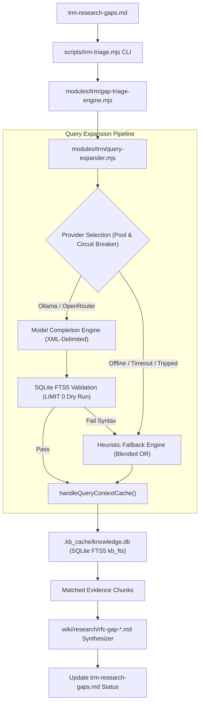

# Topic Research Mining: Cognitive query expansion design

## Overview

The Topic Research Mining (TRM) triage engine evaluates pending research gaps in `trm-research-gaps.md` by querying the local SQLite context cache (`.kb_cache/knowledge.db`) and drafting structured RFC decision notes.

Currently, the engine uses raw text concatenation of gap titles and descriptions, executing lexical SQLite FTS5 queries with default token matching. This design introduces **Cognitive Query Expansion (Path A)**: an isolated, fail-soft query expansion layer that routes gap statements through local or remote language models (Ollama / OpenRouter) to produce structured FTS5 boolean expressions (`AND`, `OR`, synonyms, and prefix wildcards), backed by deterministic heuristic fallback parsing, concurrency pooling with circuit breakers, and direct SQLite FTS5 syntax validation.

---

## Architecture and component boundaries


<details>
<summary>Mermaid source for TRM Gap Triage Architecture</summary>


</details>

### Module responsibilities

1. **`kb-sync/modules/trm/query-expander.mjs`** *(New)*
   * `expandSearchQuery(gap, options)`: Resolves provider, executes expansion with timeout and concurrency pool, validates FTS5 syntax directly against SQLite, and applies heuristic fallback on failure.
   * `callProviderWithTimeout(prompt, providerConfig, timeoutMs)`: Dispatches prompt to Ollama or OpenRouter using an `AbortController` timeout (default: 5000ms).
   * `validateFts5Query(dbInstance, rawQuery)`: Executes a dry-run test query (`SELECT 1 FROM kb_fts WHERE kb_fts MATCH ? LIMIT 0`). If SQLite throws a syntax error, returns `false` to trigger fail-soft fallback.
   * `heuristicFallbackExpand(gap)`: Extracts alphanumeric keywords, filters English stopwords, and builds a blended wildcard clause (`("title_word1"* OR "title_word2"*) OR ("desc_word1"* OR "desc_word2"*)`).
   * `createCircuitBreaker(threshold)`: Tracks consecutive provider failures and automatically trips to offline mode if failures exceed threshold (default: 2).

2. **`kb-sync/modules/trm/gap-triage-engine.mjs`** *(Modified)*
   * Converts `executeGapTriage` and `triageGapAgainstCache` into an asynchronous pipeline supporting concurrent batch triage.
   * Injects validated FTS5 boolean queries into `handleQueryContextCache`.
   * Preserves RFC synthesis and backlink updates in `trm-research-gaps.md`.

3. **`kb-sync/scripts/trm-triage.mjs`** *(Modified)*
   * Adds CLI argument parsing:
     * `--provider=<auto|ollama|openrouter|offline>`
     * `--model=<model_name>`
     * `--timeout=<ms>`
     * `--concurrency=<number>`
     * `--no-expand`

---

## Prompt engineering and schema contract

To isolate untrusted gap text from system instructions, the prompt wraps inputs in explicit XML delimiters and instructs the model to return strict JSON:

```text
You are a search query expansion expert. Convert the following engineering gap into a structured SQLite FTS5 full-text boolean query.

<gap_title>
[Title text truncated to 500 chars]
</gap_title>

<gap_description>
[Description text truncated to 500 chars]
</gap_description>

Return a single JSON object with this exact structure:
{
  "core_concepts": ["concept1", "concept2"],
  "synonyms": ["syn1", "syn2", "syn3"],
  "fts5_query": "(\"term1\" OR \"syn1\") AND (\"term2\" OR \"syn2\")"
}
```

### Prompt rules
1. Extract 2 to 3 core concepts from the gap title and description.
2. Generate domain-specific technical synonyms, acronyms, and related operational terms.
3. Group synonyms with `OR`, combine concept groups with `AND`, and enclose every literal token in double quotes.
4. Output valid JSON only, without markdown code fences or conversational preambles.

---

## Direct SQLite FTS5 validation and error recovery

Rather than relying on brittle regex repairs, the engine validates generated queries directly against SQLite:

1. **Dry-run execution**: Execute `SELECT 1 FROM kb_fts WHERE kb_fts MATCH ? LIMIT 0` on the active database connection.
2. **Instant recovery**: If SQLite executes cleanly, accept the query. If SQLite throws an FTS5 syntax error (e.g. malformed boolean expression, dangling operator, or reserved token), catch the error, log a debug warning, and immediately route to `heuristicFallbackExpand`.

---

## Deterministic heuristic fallback engine

When the language model is offline, disabled, times out (>5000ms), fails JSON parsing, or outputs invalid FTS5 syntax, `heuristicFallbackExpand` executes:

1. **Token extraction**: Split title and description into alphanumeric words.
2. **Stopword filtering**: Remove English grammatical stopwords (`a`, `an`, `the`, `is`, `are`, `for`, `from`, `in`, `on`, `to`, `with`, `by`, `about`, `into`).
3. **Blended OR construction**:
   * Deduplicate remaining keywords.
   * Construct a blended wildcard query:
     ```text
     ("title_term1"* OR "title_term2"*) OR ("desc_term1"* OR "desc_term2"*)
     ```
   * Allow SQLite's BM25 ranking algorithm to naturally score and surface documents containing the highest density of matching terms.

---

## Concurrency pooling and circuit breaker

1. **Concurrency pool**: Batch triage processes up to 3 gaps concurrently to optimize model throughput without saturating local resources or rate limits.
2. **Circuit breaker**: If 2 consecutive model requests fail or time out, the circuit breaker trips, routing all remaining gaps in the current batch directly to the heuristic fallback engine to eliminate cumulative latency.

---

## Environment configuration

| Variable | Default | Description |
|---|---|---|
| `TRM_LLM_PROVIDER` | `auto` | Provider mode: `auto` (Ollama -> OpenRouter -> offline), `ollama`, `openrouter`, or `offline` |
| `TRM_OLLAMA_MODEL` | `qwen2.5-coder:7b` | Model name for local Ollama completions |
| `TRM_OPENROUTER_MODEL` | `google/gemini-2.0-flash-001` | Model identifier for OpenRouter fallback |
| `TRM_EXPANDER_TIMEOUT` | `5000` | Maximum execution timeout in milliseconds per request |
| `TRM_EXPANDER_CONCURRENCY` | `3` | Maximum concurrent model requests |
| `OLLAMA_BASE_URL` | `http://host.docker.internal:11434/v1` | Local Ollama HTTP base endpoint |

---

## Verification plan

### 1. Automated unit tests (`kb-sync/tests/query-expander.test.mjs`)
* **Validation tests**: Verify that valid FTS5 expressions pass and invalid syntax triggers fallback.
* **Heuristic fallback tests**: Verify stopword filtering, wildcard formatting, blended `OR` generation, and empty/single-word gap safety.
* **Circuit breaker tests**: Verify that consecutive failures trip the circuit breaker and bypass network calls.
* **Provider mock tests**: Verify Ollama completion parsing, OpenRouter fallback, and timeout aborts.

### 2. Integration and regression tests (`kb-sync/tests/gap-triage-engine.test.mjs`)
* Execute `executeGapTriage` with `--dry-run` on sample gap files.
* Verify generated RFC frontmatter (`citations`, `topic`, `gap_id`) and evidence snippets.
* Run `npm run test:cache` to confirm existing SQLite FTS5 database tests pass.
* Run `npm run test:trm` to verify end-to-end TRM pipeline compatibility.
