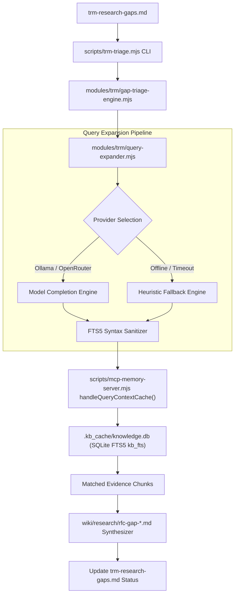

# Topic Research Mining: Cognitive query expansion design

## Overview

The Topic Research Mining (TRM) triage engine evaluates pending research gaps in `trm-research-gaps.md` by querying the local SQLite context cache (`.kb_cache/knowledge.db`) and drafting structured RFC decision notes.

Currently, the engine uses raw text concatenation of gap titles and descriptions, executing lexical SQLite FTS5 queries with default token matching. This design introduces **Cognitive Query Expansion (Path A)**: an isolated, fail-soft query expansion layer that routes gap statements through local or remote language models (Ollama / OpenRouter) to produce structured FTS5 boolean expressions (`AND`, `OR`, synonyms, and prefix wildcards), backed by deterministic heuristic fallback parsing and strict syntax sanitization.

---

## Architecture and component boundaries



### Module responsibilities

1. **`kb-sync/modules/trm/query-expander.mjs`** *(New)*
   * `expandSearchQuery(gap, options)`: Resolves provider, executes expansion with timeout, sanitizes FTS5 syntax, and applies heuristic fallback on failure.
   * `callProviderWithTimeout(prompt, providerConfig, timeoutMs)`: Dispatches prompt to Ollama or OpenRouter using an `AbortController` timeout (default: 2000ms).
   * `sanitizeFts5Query(rawQuery)`: Normalizes quotes, balances parentheses, strips SQLite control characters, and removes dangling boolean operators.
   * `heuristicFallbackExpand(gap)`: Extracts alphanumeric keywords, filters English stopwords, and builds wildcard clauses (`token*`).

2. **`kb-sync/modules/trm/gap-triage-engine.mjs`** *(Modified)*
   * Converts `triageGapAgainstCache` into an asynchronous workflow or accepts pre-expanded search queries.
   * Injects structured FTS5 queries into `handleQueryContextCache`.
   * Preserves RFC synthesis and backlink updates in `trm-research-gaps.md`.

3. **`kb-sync/scripts/trm-triage.mjs`** *(Modified)*
   * Adds CLI argument parsing:
     * `--provider=<auto|ollama|openrouter|offline>`
     * `--model=<model_name>`
     * `--timeout=<ms>`
     * `--no-expand`

---

## Prompt engineering and schema contract

To prevent model hallucination and ensure deterministic parsing, the query expander prompts the model to emit strict JSON matching this schema:

```json
{
  "core_concepts": ["WebSocket", "connection"],
  "synonyms": ["WS", "keep-alive", "socket", "teardown", "heartbeat"],
  "fts5_query": "(\"WebSocket\" OR \"WS\" OR \"socket\") AND (\"disconnect\" OR \"teardown\" OR \"drop\" OR \"heartbeat\")"
}
```

### Prompt rules
1. Extract 2 to 3 core concepts from the gap title and description.
2. Generate domain-specific technical synonyms, acronyms, and related operational terms.
3. Group synonyms with `OR`, combine concept groups with `AND`, and enclose every literal token in double quotes.
4. Output valid JSON only, without markdown code fences or conversational preambles.

---

## FTS5 syntax validator and sanitizer

SQLite FTS5 aborts query execution when encountering unbalanced quotes, unclosed parentheses, or unsupported control operators. The `sanitizeFts5Query` routine executes the following verification pipeline:

1. **Quote balancing**: Scan for unescaped double quotes. If odd, append a trailing quote or strip unpaired instances.
2. **Parenthesis balance check**: Count opening `(` and closing `)` delimiters. If counts diverge, strip all parentheses to prevent SQLite syntax errors.
3. **Control character removal**: Strip reserved SQLite symbols (`:`, `^`, `{`, `}`, `~`).
4. **Dangling operator elimination**: Remove leading, trailing, or repeated boolean operators (`AND`, `OR`, `NOT`).
5. **Length and token bounds**: Reject strings exceeding 500 characters or containing fewer than 2 valid tokens, routing execution to the heuristic fallback engine.

---

## Deterministic heuristic fallback engine

When the language model is offline, disabled, or fails to respond within the configured timeout window (default 2000ms), `heuristicFallbackExpand` executes:

1. **Token extraction**: Split title and description into alphanumeric words.
2. **Stopword filtering**: Remove English grammatical stopwords (`a`, `an`, `the`, `is`, `are`, `for`, `from`, `in`, `on`, `to`, `with`, `by`, `about`, `into`).
3. **Compound query construction**:
   * Deduplicate remaining keywords.
   * If both title and description contain valid keywords, construct a 2-tier query:
     ```text
     ("title_term1"* OR "title_term2"*) AND ("desc_term1"* OR "desc_term2"*)
     ```
   * If the combined query contains fewer than 2 valid keywords, join all extracted tokens with `OR`.

---

## Environment configuration

| Variable | Default | Description |
|---|---|---|
| `TRM_LLM_PROVIDER` | `auto` | Provider mode: `auto` (Ollama -> OpenRouter -> offline), `ollama`, `openrouter`, or `offline` |
| `TRM_OLLAMA_MODEL` | `qwen2.5-coder:7b` | Model name for local Ollama completions |
| `TRM_OPENROUTER_MODEL` | `google/gemini-2.0-flash-001` | Model identifier for OpenRouter fallback |
| `TRM_EXPANDER_TIMEOUT` | `2000` | Maximum execution timeout in milliseconds before triggering heuristic fallback |
| `OLLAMA_BASE_URL` | `http://host.docker.internal:11434/v1` | Local Ollama HTTP base endpoint |

---

## Verification plan

### 1. Automated unit tests (`kb-sync/tests/query-expander.test.mjs`)
* **Sanitizer tests**: Verify handling of unbalanced quotes, unclosed parentheses, reserved SQLite symbols, and trailing `AND`/`OR` operators.
* **Heuristic fallback tests**: Verify stopword filtering, wildcard token formatting, and empty gap handling.
* **Provider timeout tests**: Mock a slow provider and confirm graceful fallback within the specified timeout.
* **Provider response parsing**: Verify extraction of `fts5_query` from JSON payloads and rejection of malformed outputs.

### 2. Integration and regression tests
* Execute `executeGapTriage` with `--dry-run` on sample gap markdown files and assert generated RFC content and citations.
* Run `npm run test:cache` to confirm existing SQLite FTS5 database tests pass.
* Run `npm run test:trm` to verify end-to-end TRM pipeline compatibility.
