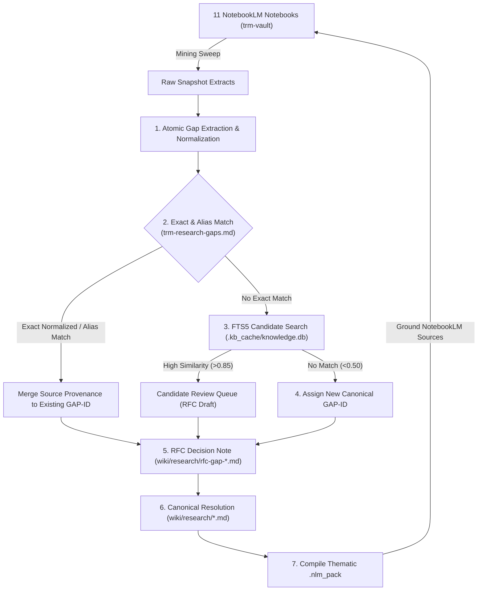

# Topic Research Mining: Cross-notebook gap deduplication and lifecycle management design

## Overview

The Topic Research Mining (TRM) pipeline extracts research gaps, unverified claims, and historical contradictions across 11 NotebookLM notebooks in `trm-vault` (including *Willow Run Videos*, *CIC Daily Research*, *Cuban Seizures*, and *Ford Executive Dynamics*).

During multi-notebook mining sweeps, repeated and overlapping questions frequently emerge across notebooks (for example, B-17 manufacturing claims at Willow Run, Sorensen Cuban estate claims, and Albert Kahn L-Bend tax legends). 

This specification defines a deterministic, single-source-of-truth architecture to eliminate duplicate research items, prevent cross-notebook state drift, and govern the retirement lifecycle of resolved historical inquiries.

---

## Architectural decisions and tradeoffs

### 1. Rejection of per-notebook Q&A logs
Embedding "questions answered across repos" lists into every individual notebook introduces an $O(N)$ distributed state synchronization problem across all 11+ notebooks. Divergent sync states consume NotebookLM grounding tokens on administrative metadata and degrade retrieval precision.

**Decision**: Maintain a single canonical registry in the central Git repository and knowledge base. Never synchronize resolution state back into notebooks as free-form Q&A logs.

### 2. Authority model: Git-tracked registry as primary authority
Maintaining writable authority across both SQLite and Git-tracked markdown notes guarantees drift.

**Decision**:
* **Primary Authority**: The Git-tracked canonical registry (`wiki/research/` canonical notes and `trm-research-gaps.md`) is the sole write authority.
* **Derived Index**: SQLite (`.kb_cache/knowledge.db`) serves as a derived, rebuildable read-cache and FTS5 search index.

### 3. Rejection of unsupervised fuzzy auto-suppression
Semantic similarity matching alone cannot safely retire research gaps. Inquiries sharing 90% textual similarity often differ in date range, facility location, legal entity, or contradictory source sets (such as B-17 subcontracting at Willow Run vs. complete airframe assembly).

**Decision**: Exact normalized hashes and approved alias tables drive automatic grouping. FTS5 and semantic embeddings serve strictly for candidate retrieval and human review queues, never for silent auto-retirement.

---

## Architecture and processing pipeline

<details>
<summary>Mermaid source for TRM Gap Deduplication Pipeline</summary>


</details>

---

## Question identity and deduplication strategy

### 1. Atomic gap normalization
Compound mining extracts often bundle multiple distinct factual inquiries into a single paragraph. Prior to matching, the ingestion engine splits compound extracts into atomic research objectives:

1. Strip markdown boilerplate, conversational artifacts, and prompt citations (`[1]`, `[2]`).
2. Extract the canonical subject entity, predicate claim, time boundary, and primary location.
3. Compute a deterministic `scope_hash` via SHA-256 over normalized tokens delimited with unit separators (`\x1f`):
   $$\text{scope\_hash} = \text{SHA-256}(\text{entity} \parallel \text{"\x1f"} \parallel \text{claim} \parallel \text{"\x1f"} \parallel \text{time\_period} \parallel \text{"\x1f"} \parallel \text{location})$$

### 2. Multi-tier matching hierarchy

| Matching tier | Mechanism | Action taken |
|---|---|---|
| **Tier 1: Exact Hash** | SHA-256 match on `scope_hash` or normalized objective. | Merge notebook occurrence into existing `GAP-XX` provenance list without creating a new record. |
| **Tier 2: Explicit Alias** | Match against canonical alias table (`trm-gap-aliases.json`). | Link to existing canonical `GAP-XX` record. |
| **Tier 3: FTS5 Candidate Queue** | SQLite FTS5 BM25 match against existing open/resolved gaps. | Surface candidate link in RFC draft triage queue for explicit confirmation. |
| **Tier 4: Greenfield** | No lexical or FTS match. | Mint a new sequential `GAP-XX` identifier. |

### 3. Contradiction isolation vs. deduplication
When two notebooks report conflicting evidence on the same historical event (for example, whether B-17 parts or full assemblies were built), the pipeline merges the **research objective** under a single `GAP-XX` dossier, but preserves both competing claims and their respective source citations. Contradictions must never be collapsed into a single claim during deduplication.

---

## Deterministic state lifecycle

```text
discovered -> clustered -> active -> resolved -> published -> retired
                         \-> duplicate
                         \-> rejected
                         \-> blocked
resolved / published / retired -> reopened
```

### State transitions

1. **`discovered`**: Extracted from raw notebook mining snapshot.
2. **`clustered`**: Mapped to a canonical `GAP-XX` ID via exact match or alias.
3. **`active`**: RFC draft generated in `wiki/research/rfc-gap-*.md` with linked sources.
4. **`resolved`**: Primary evidence grounded and documented in canonical wiki note.
5. **`published`**: Compiled into thematic `.nlm_pack/pack_*.txt` with provenance headers.
6. **`retired`**: Grounded in NotebookLM; suppressed from active triage queues.
7. **`reopened`**: Re-activated if new contradictory evidence surfaces, scope changes, or an existing grounded claim is disputed.

---

## Prevention of circular synthetic evidence

When resolved wiki notes are compiled into `.nlm_pack` files and uploaded to NotebookLM, subsequent mining sweeps may read synthesized text as independent primary sources.

To prevent circular evidence feedback loops:
1. Every generated entry in `.nlm_pack` must include explicit provenance frontmatter:
   ```yaml
   provenance_type: "synthesized_canonical_resolution"
   canonical_gap_id: "GAP-03-VIDEOS"
   source_evidence_citations: ["WPB Schedule contracts", "BVD Pool records"]
   generation_timestamp: "2026-09-20T19:58:00Z"
   ```
2. Mining parsers must filter out quotes tagged with `synthesized_canonical_resolution` when extracting candidate primary claims.

---

## Canonical schema contract

### Registry schema (`trm-research-gaps.json` / SQLite `trm_gaps`)

```json
{
  "$schema": "https://json-schema.org/draft/2020-12/schema",
  "title": "TRMResearchGap",
  "type": "object",
  "required": [
    "gap_id",
    "canonical_objective",
    "scope_hash",
    "status",
    "source_notebooks",
    "first_seen",
    "last_seen"
  ],
  "properties": {
    "gap_id": { "type": "string", "pattern": "^GAP-[0-9]{2,3}(-[A-Z]+)?$" },
    "canonical_objective": { "type": "string" },
    "scope_hash": { "type": "string", "pattern": "^[a-f0-9]{64}$" },
    "status": {
      "type": "string",
      "enum": ["discovered", "clustered", "active", "resolved", "published", "retired", "reopened", "rejected", "blocked"]
    },
    "canonical_note_path": { "type": ["string", "null"] },
    "evidence_refs": {
      "type": "array",
      "items": { "type": "string" }
    },
    "source_notebooks": {
      "type": "array",
      "items": {
        "type": "object",
        "required": ["notebook_name", "first_seen", "entry_key"],
        "properties": {
          "notebook_name": { "type": "string" },
          "first_seen": { "type": "string", "format": "date-time" },
          "entry_key": { "type": "string" }
        }
      }
    },
    "aliases": {
      "type": "array",
      "items": { "type": "string" }
    },
    "pack_version": { "type": ["string", "null"] },
    "reopen_reason": { "type": ["string", "null"] }
  }
}
```

---

## Implementation roadmap

### Phase 1: Ingestion normalizer and alias resolver
1. Implement `kb-sync/modules/trm/gap-normalizer.mjs` to tokenize questions and compute canonical `scope_hash` values.
2. Create `kb-sync/data/trm-gap-aliases.json` to store verified question aliases.
3. Add unit test suite in `kb-sync/tests/gap-normalizer.test.mjs` covering entity extraction, hash collision resistance, and compound question splitting.

### Phase 2: Orchestration pipeline integration
1. Update `scripts/run-closed-loop-research-v2.mjs` to execute normalization and multi-tier matching during Step 1 (Gaps Ingestion).
2. Update `scripts/trm-triage.mjs` to auto-link multi-notebook sources into active RFC notes.
3. Validate idempotency: repeated ingestion of identical snapshots must produce zero diffs.

### Phase 3: Pack provenance and grounding audit
1. Update `.nlm_pack` generator to embed synthetic provenance metadata.
2. Add regression tests validating that grounded `.nlm_pack` entries do not re-surface as new unverified claims.
