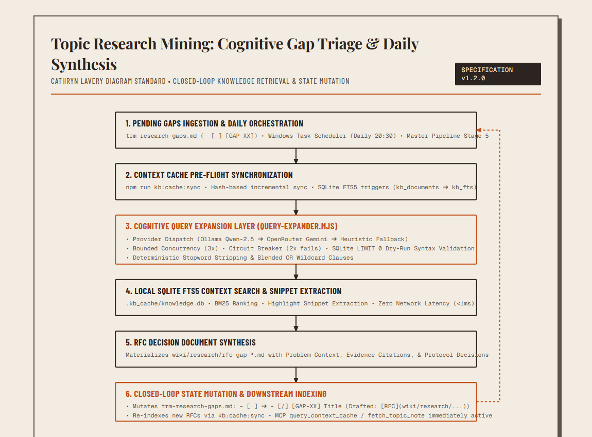
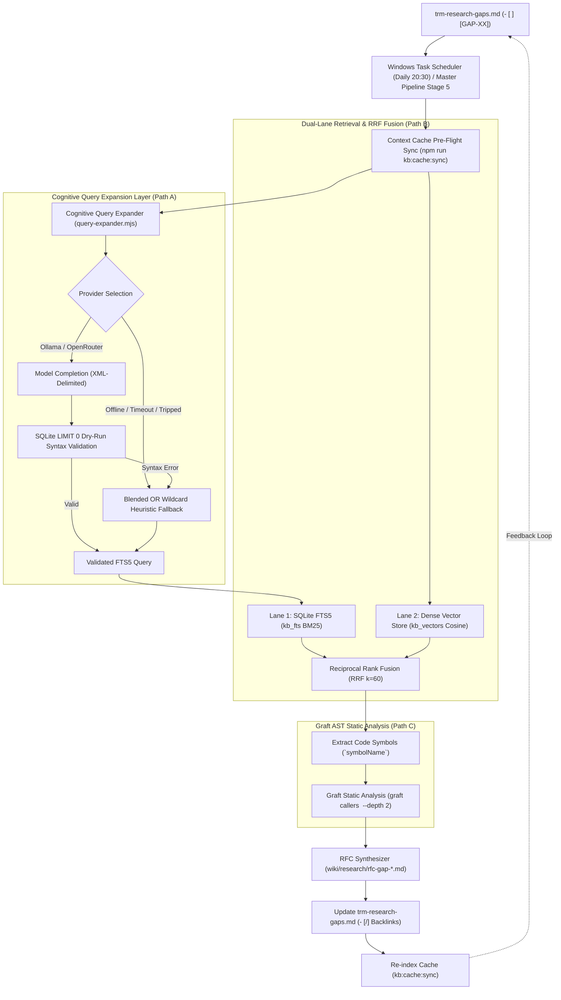

# Knowledge Base Sync Pipeline (`kb-sync`)

The `kb-sync` pipeline provides automated knowledge management, synthesis, and real-time retrieval for engineering artifacts, architecture decision records, and deep research matrices across local workspaces and external targets.

---

## Core systems

### 1. Topic Research Matrix (TRM) closed-loop pipeline
The TRM pipeline ingests structured research payloads, enforces strict semantic validation (checksum verification, directory traversal protection, and orphan file rejection), and synthesizes structured wiki nodes and conceptual linkage graphs.

- **Staging directory**: `_kb-sync-staging/trm/`
- **Output directories**: `wiki/research/`, `wiki/concepts/`, and `obsidian/vault/wiki/`
- **Execution command**: `npm run kb:pipeline:trm`

### 2. Competitor Watchlist & Drift Monitoring (`watch-competitors-v2.mjs`)
Automated daemon for monitoring competitor codebases and upstream specifications (e.g., Google SAM, Volcengine OpenViking) against local Layer 2 reference baselines.

- **Security & SSRF mitigation**: Pins DNS queries directly to socket connections, blocking private IP ranges, cloud metadata endpoints, loopback addresses, and unauthorized schemes.
- **Drift detection**: Performs SHA-256 target hash comparison, triggering zero token spend on cache hits and executing longest common subsequence (LCS) line diffs on drift.
- **Sigil governance gate**: Constructs RFC 8785 canonicalized, Ed25519-signed Sigil v1.0.0 envelopes persisted into SQLite `local_approvals` for human-in-the-loop review.
- **Execution commands**:
  - Run monitor: `npm run trm:watch`
  - Run integration validation: `npm run test:watchlist`
  - Run test suite: `npm run test:trm:watch`

### 3. Local SQLite context cache & Vector Store
An embedded SQLite database utilizing `fts5` full-text search with BM25 ranking, dense vector embeddings (`kb_vectors` table), and Unicode tokenization. Provides sub-millisecond lexical search, dense semantic similarity, and snippet extraction without network latency.

- **Database path**: `.kb_cache/knowledge.db`
- **Schema tables**:
  - `kb_documents`: Primary document repository storing category, topic slug, relative file path, content, SHA-256 hash, and timestamps.
  - `kb_fts`: Virtual FTS5 table synchronized via database triggers (`AFTER INSERT`, `AFTER UPDATE`, and `AFTER DELETE`).
  - `kb_vectors`: Dense vector table storing 384-dimensional `Float32Array` binary BLOB embeddings for semantic search.
- **Sync script**: `npm run kb:cache:sync`

### 4. Model Context Protocol (MCP) server
Exposes the local SQLite context cache directly to interactive coding agents (e.g., Antigravity, Claude Desktop, Cursor) via stdio JSON-RPC.

- **Server entrypoint**: `scripts/mcp-memory-server.mjs`
- **Protocol**: JSON-RPC 2.0 over stdio (supports standard MCP handshake: `initialize`, `tools/list`, `tools/call`, `ping`).
- **Exposed tools**:
  - `query_context_cache`: BM25 lexical keyword search across cached research nodes with highlight snippets.
  - `fetch_topic_note`: Direct retrieval of full markdown documents and metadata by topic identifier.

### 5. TRM Cognitive Gap Triage, Hybrid Semantic RAG & AST Grounding
Automated daily research triage that evaluates pending gaps in `trm-research-gaps.md`, expands search queries using local (Ollama) or remote (OpenRouter) models with fail-soft heuristic fallbacks, executes dual-lane retrieval (FTS5 + Dense Vector) blended via Reciprocal Rank Fusion (RRF), grounds candidate code symbols using Graft AST static analysis, and synthesizes structured RFC decision documents in `wiki/research/`.



<details>
<summary>Mermaid source for TRM Gap Triage Architecture</summary>


</details>

- **Query expander module**: `modules/trm/query-expander.mjs`
- **Dense vector store module**: `modules/cache/vector-store.mjs`
- **AST grounding module**: `modules/trm/ast-grounding.mjs`
- **Triage engine**: `modules/trm/gap-triage-engine.mjs`
- **CLI entrypoint**: `scripts/trm-triage.mjs`
- **Task wrapper**: `scripts/schedule-task-wrapper-TRM-Triage.ps1`
- **Task registration**: `scripts/register-trm-triage-task.ps1`
- **Scheduled time**: Daily at 20:30 (8:30 PM)

---

## Operating commands

### TRM automated gap triage & hybrid synthesis
```bash
# Run daily scheduled wrapper (includes cache pre-sync & logging)
npm run trm:triage:daily

# Execute automated gap triage with cognitive query expansion and hybrid vector search
npm run trm:triage:auto

# Run gap triage in deterministic offline heuristic mode
npm run trm:triage:offline

# Run dry run without modifying files
npm run trm:triage:dry-run
```

### Knowledge cache & vector synchronization
```bash
# Sync all markdown documents and generate dense vector embeddings in SQLite
npm run kb:cache:sync

# Start stdio MCP server for agent integration
npm run kb:cache:server
```

### Competitor watchlist monitoring
```bash
# Monitor competitor targets and evaluate drift
npm run trm:watch

# Execute SQLite foreign-key and Sigil approval integration test
npm run test:watchlist

# Run complete watcher unit & vitest suites
npm run test:trm:watch
```

### Testing & Verification
```bash
# Run all unit tests for query expander, vector store, AST grounding, and triage
node --test tests/vector-store.test.mjs tests/ast-grounding.test.mjs tests/query-expander.test.mjs tests/trm-gap-triage.test.ts tests/trm-cache-boundary.test.mjs

# Run full TRM validation suite
npm run test:trm
```
