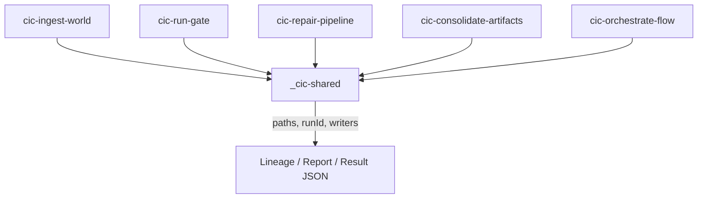

# Integration Diagram

```mermaid
graph TD
  CicIngestWorld[cic-ingest-world] --> CicShared[_cic-shared]
  CicRunGate[cic-run-gate] --> CicShared
  CicRepairPipeline[cic-repair-pipeline] --> CicShared
  CicConsolidateArtifacts[cic-consolidate-artifacts] --> CicShared
  CicOrchestrateFlow[cic-orchestrate-flow] --> CicShared
  CicShared -->|paths, runId, writers| Output[Lineage / Report / Result JSON]
```
