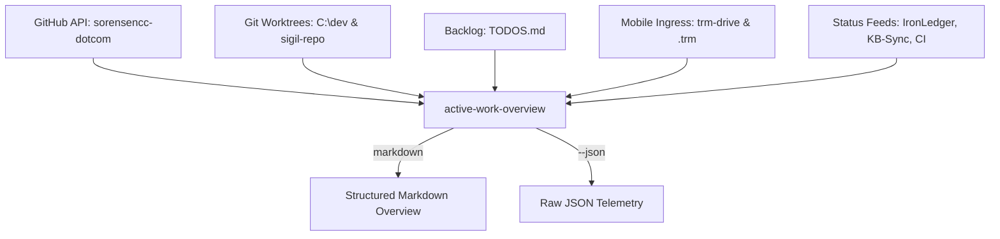

# Integration Diagram

```mermaid
graph TD
  GitHub[GitHub API: sorensencc-dotcom] --> Overview[active-work-overview]
  Worktrees[Git Worktrees: C:\dev & sigil-repo] --> Overview
  Todos[Backlog: TODOS.md] --> Overview
  Outbox[Mobile Ingress: trm-drive & .trm] --> Overview
  Telemetry[Status Feeds: IronLedger, KB-Sync, CI] --> Overview
  Overview -->|markdown| Report[Structured Markdown Overview]
  Overview -->|--json| JsonData[Raw JSON Telemetry]
```
