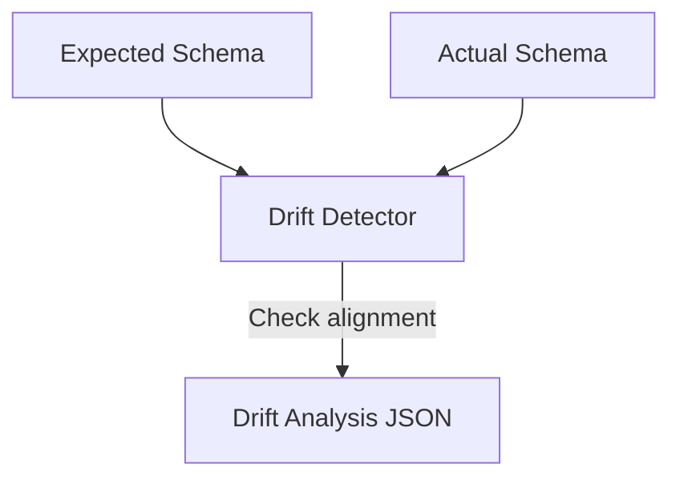

# Integration Diagram

```mermaid
graph TD
  Expected[Expected Schema] --> DriftDetector[Drift Detector]
  Actual[Actual Schema] --> DriftDetector
  DriftDetector -->|Check alignment| Output[Drift Analysis JSON]
```
