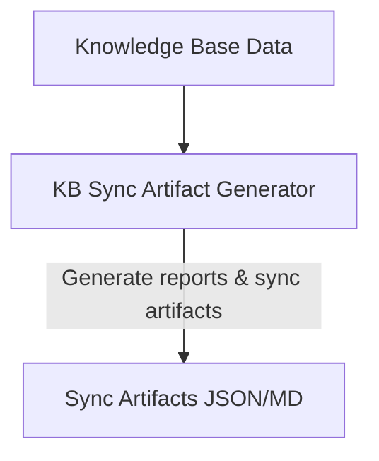

# Integration Diagram

```mermaid
graph TD
  Source[Knowledge Base Data] --> Generator[KB Sync Artifact Generator]
  Generator -->|Generate reports & sync artifacts| Output[Sync Artifacts JSON/MD]
```
