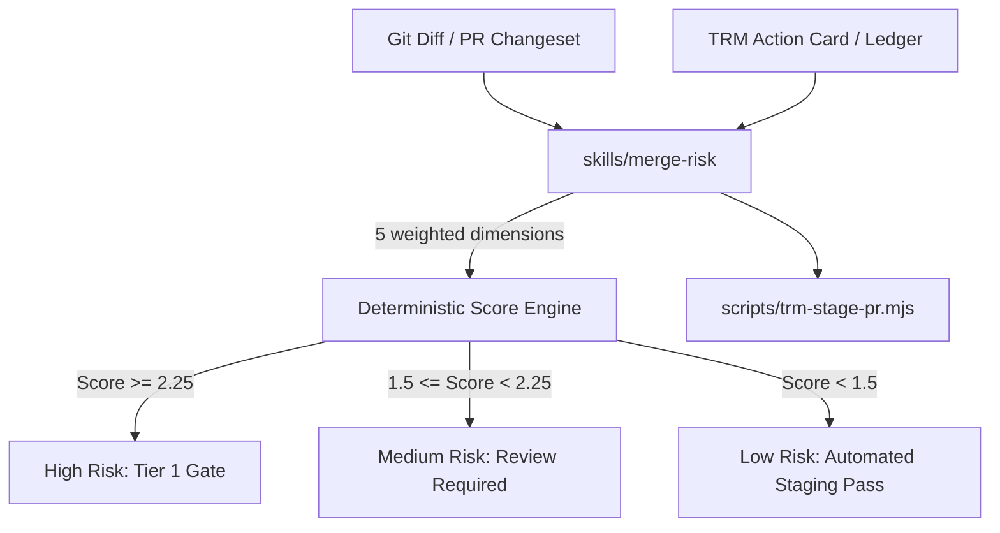

# Integration Diagram

```mermaid
graph TD
  Diff[Git Diff / PR Changeset] --> Evaluator[skills/merge-risk]
  Card[TRM Action Card / Ledger] --> Evaluator
  Evaluator -->|5 weighted dimensions| Scoring[Deterministic Score Engine]
  Scoring -->|Score >= 2.25| HighRisk[High Risk: Tier 1 Gate]
  Scoring -->|1.5 <= Score < 2.25| MedRisk[Medium Risk: Review Required]
  Scoring -->|Score < 1.5| LowRisk[Low Risk: Automated Staging Pass]
  Evaluator --> StagePR[scripts/trm-stage-pr.mjs]
```
