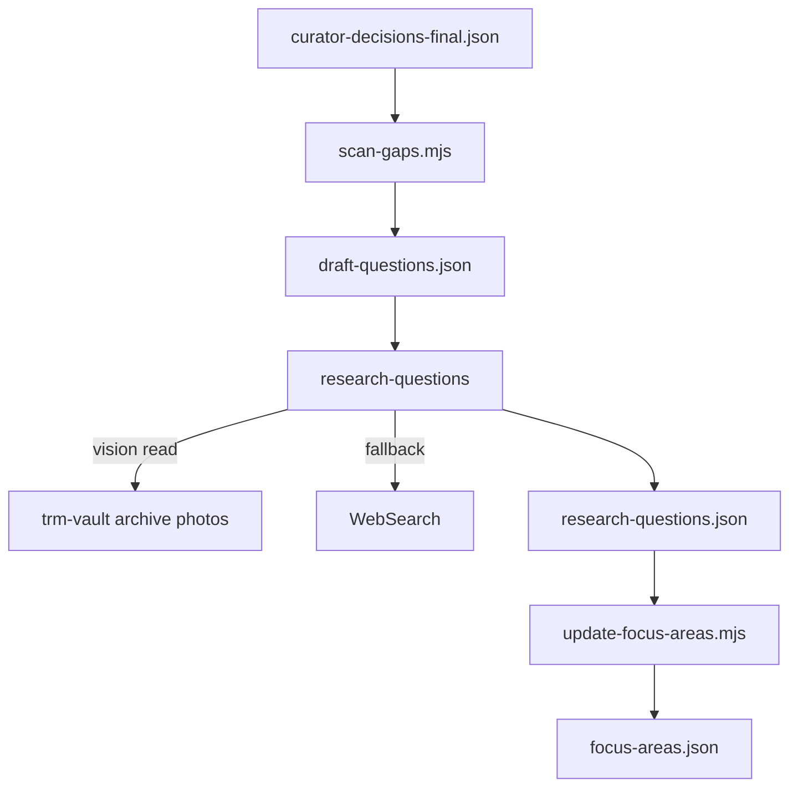

# Integration Diagram

```mermaid
graph TD
  CuratorDecisions[curator-decisions-final.json] --> ScanGaps[scan-gaps.mjs]
  ScanGaps --> DraftQuestions[draft-questions.json]
  DraftQuestions --> ResearchQuestions[research-questions]
  ResearchQuestions -->|vision read| ArchivePhotos[trm-vault archive photos]
  ResearchQuestions -->|fallback| WebSearch[WebSearch]
  ResearchQuestions --> ResearchQuestionsJson[research-questions.json]
  ResearchQuestionsJson --> UpdateFocusAreas[update-focus-areas.mjs]
  UpdateFocusAreas --> FocusAreasJson[focus-areas.json]
```
