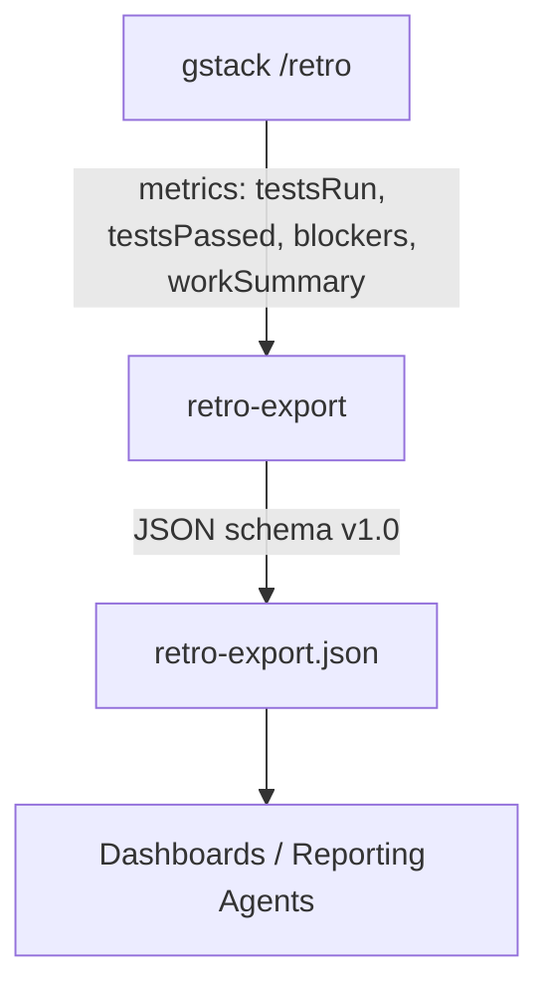

# Integration Diagram

```mermaid
graph TD
  Retro[gstack /retro] -->|metrics: testsRun, testsPassed, blockers, workSummary| RetroExport[retro-export]
  RetroExport -->|JSON schema v1.0| File[retro-export.json]
  File --> Consumer[Dashboards / Reporting Agents]
```
