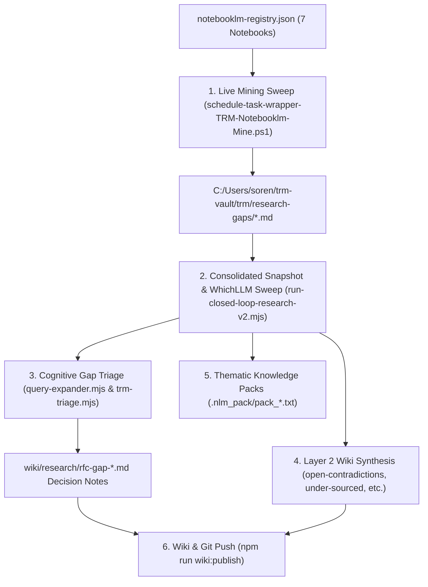

# Topic Research Mining (TRM) Closed-Loop Research Workflow

This skill executes the end-to-end Topic Research Mining (TRM) research loop: mining live research notebooks in `trm-vault`, expanding and triaging discovered knowledge gaps against the local SQLite context cache, synthesizing Layer 2 wiki notes, and building thematic `.nlm_pack` files for NotebookLM grounding.

---

## Architecture Overview



---

## Execution Procedures

### 1. Multi-Notebook Mining Sweep
To mine all registered notebooks in `notebooklm-registry.json` into `C:\Users\soren\trm-vault\trm\research-gaps\`:
```powershell
pwsh.exe -NoProfile -ExecutionPolicy Bypass -File C:\dev\schedule-task-wrapper-TRM-Notebooklm-Mine.ps1
```
*Outputs updated markdown tables for:*
- `cic-kb.md`
- `cic-daily-research.md`
- `willow-run-videos.md`
- `cast-iron-charlie-research-logs.md`
- `the-sorensen-photographic-archive-industrial-giants-at-willow-run.md`
- `castironcharlie-facebook.md`
- `cic-reddit.md`

---

### 2. Closed-Loop Orchestration & Wiki Synthesis
Run the live closed-loop synthesis orchestrator from the `C:\dev` repository root:
```bash
# Ingest mined gaps, synthesize Layer 2 wiki topics, and build .nlm_pack files
$env:TRM_SKIP_MINE='1'; node scripts/run-closed-loop-research-v2.mjs
```
*Actions performed:*
1. **Step 0 — WhichLLM Benchmark Sweep**: Reads hardware-aware model benchmark matrix (`_integration/model_selection.json`).
2. **Step 1 — Gaps Ingestion**: Writes consolidated snapshot to `trm-research-gaps.md`.
3. **Step 2 — NotebookLM Grounding**: Uploads gaps snapshot to the target daily notebook.
4. **Step 3 — Topic Derivation**: Extracts the 4 core research dimensions (`open-contradictions`, `under-sourced`, `adjacent-topics`, `follow-up`).
5. **Step 4 — Layer 2 Wiki Synthesis**: Synthesizes structured markdown pages in `wiki/research/`.
6. **Step 5 — Audit Log**: Appends run telemetry and SHA-256 hash chains to `wiki/Log.md`.
7. **Step 6 — Knowledge Packs**: Rebuilds thematic `.nlm_pack/pack_*.txt` files.

---

### 3. Automated Gap Triage & RFC Note Drafting
Evaluate pending gaps using cognitive query expansion against the SQLite context cache (`.kb_cache/knowledge.db`):
```bash
# Full daily wrapper with cache pre-sync and logging
npm run trm:triage:daily

# Direct CLI run with auto provider (Ollama -> OpenRouter -> Heuristic)
npm run trm:triage:auto
```
*Actions performed:*
- Expands each pending gap query using local or remote LLMs with SQLite `LIMIT 0` dry-run validation.
- Queries SQLite FTS5 index for sub-millisecond lexical snippet matches.
- Generates structured RFC decision notes in `wiki/research/rfc-gap-*.md`.
- Mutates `trm-research-gaps.md` by linking in-progress gaps to their drafted RFCs.

---

### 4. Publish and Sync Knowledge Base & Wiki
Publish newly synthesized RFCs, concept nodes, and research topics to the GitHub Wiki:
```bash
# Synchronize and push all wiki docs to GitHub Wiki
npm run wiki:publish
```

---

## Verifying & Testing
```bash
# Run TRM query expander unit tests (25 tests)
node --test kb-sync/tests/query-expander.test.mjs

# Run local SQLite cache tests
npm run test:cache

# Run TRM pipeline sandbox validation tests
npm run test:trm
```
