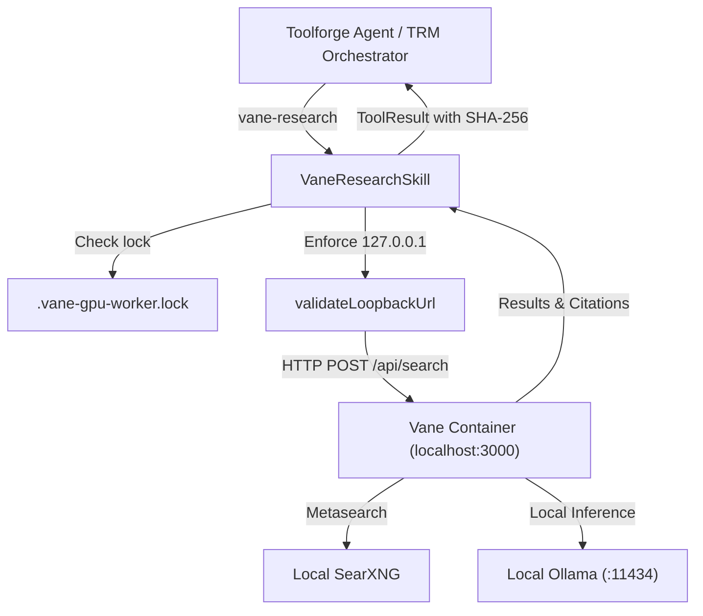

# Integration Diagram: vane-research

```mermaid
flowchart TD
    Client["Toolforge Agent / TRM Orchestrator"] -->|"vane-research"| Skill["VaneResearchSkill"]
    Skill -->|"Check lock"| GPULock[".vane-gpu-worker.lock"]
    Skill -->|"Enforce 127.0.0.1"| LoopbackGate["validateLoopbackUrl"]
    LoopbackGate -->|"HTTP POST /api/search"| Vane["Vane Container (localhost:3000)"]
    Vane -->|"Metasearch"| SearXNG["Local SearXNG"]
    Vane -->|"Local Inference"| Ollama["Local Ollama (:11434)"]
    Vane -->|"Results & Citations"| Skill
    Skill -->|"ToolResult with SHA-256"| Client
```
