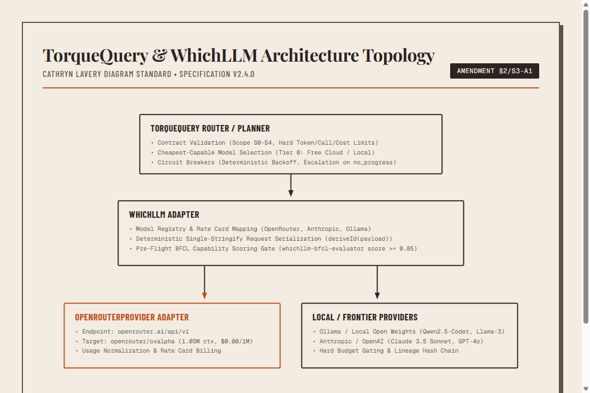
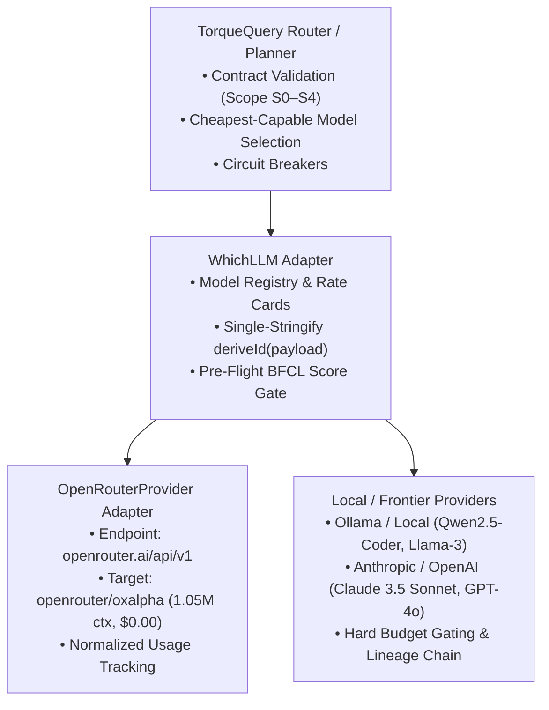

# WhichLLM v2.4.0 Model Selection & OpenRouter Evaluator

## Architecture & Purpose

The WhichLLM automated model selection matrix evaluates open-weight local and cloud-hosted LLMs for grounded tool execution, model routing, and local RAG synthesis within the CIC agent mesh and TorqueQuery pipeline.



<details>
<summary>Mermaid source...</summary>


</details>

---

## Core Disciplines & Pre-Flight BFCL Gate

Before any model (local or cloud-hosted) is granted tool-calling authority in TorqueQuery, it must pass the Berkeley Function Calling Benchmark (`whichllm-bfcl-evaluator.py`) suite across four mandatory disciplines:

1. **Simple Tool Calls** (`bfcl-cic-001-simple-read`): Invoking single-tool materializers with exact arguments.
2. **Parallel Tool Calls** (`bfcl-cic-002-parallel-dispatch`): Dispatching non-overlapping concurrent requests.
3. **Nested Tool Calls** (`bfcl-cic-003-nested-resolver`): Resolving chained execution dependencies across components.
4. **Negative Relevance Rejections** (`bfcl-cic-004-relevance-rejection`): Refusing tool invocation on non-tool queries.

### Acceptance Threshold
* **`composite_bfcl_score >= 0.85`**: Granted full tool-calling authority (`S0`–`S4`).
* **`composite_bfcl_score < 0.85`**: Restricted to read/summarize-only (`S0`/`S1`) with `max_tool_calls: 0`.

---

## OpenRouter Preview Model Registry: Ox Alpha (`openrouter/oxalpha`)

Ox Alpha is integrated as a Tier 0 preview model under the OpenRouter provider adapter.

| Parameter | Specification |
| :--- | :--- |
| **Canonical Model ID** | `openrouter/oxalpha` |
| **API Target Slug** | `oxalpha` |
| **Context Window** | 1,050,000 tokens |
| **Max Output Tokens** | 131,072 tokens |
| **Rate Card Version** | `openrouter-free-2026-08` |
| **Input Cost / 1M** | $0.00 |
| **Output Cost / 1M** | $0.00 |
| **Tier** | `tier0_preview` |

---

## WhichLLM Hardware-Aware BFCL Evaluator

The hardware-aware evaluator (`scripts/whichllm-bfcl-evaluator.mjs` and `scripts/whichllm-bfcl-evaluator.py`) executes automated Berkeley Function Calling Benchmark (BFCL) scenarios across local and frontier models, evaluates host GPU VRAM capacity, and deterministically assigns role anchors.

### Hardware Profiling & VRAM Fit Status

The evaluator profiles available accelerator hardware and classifies models into three capacity states:

* **`fits_easily`**: Model weights and KV cache fit comfortably within host VRAM with >4 GB overhead buffer.
* **`tight_vram_warning`**: Model fits in VRAM, but remaining buffer is <4 GB. Concurrency must be constrained.
* **`out_of_vram_degraded`**: Model parameter size exceeds physical VRAM, requiring offload to system RAM or quantized degradation.

On standard host hardware (1x NVIDIA RTX 4090, 24 GB VRAM, 64 GB RAM):

| Model Candidate | Parameter Size | Tier Assignment | VRAM Fit Status | BFCL Composite |
| :--- | :--- | :--- | :--- | :--- |
| `claude-3-5-sonnet-20241022` | N/A (Frontier API) | Tier 1 (Judgment Anchor) | `fits_easily` | `0.948` |
| `llama3:8b-instruct-fp16` | 8B | Tier 2 (Local Muscle Anchor) | `fits_easily` | `0.694` |
| `qwen2.5:32b-instruct-q8_0` | 32B | Tier 2 (Local Muscle) | `out_of_vram_degraded` | `0.835` |
| `llama3.1:70b-instruct-q2_k` | 70B | Tier 2 (Local Muscle) | `out_of_vram_degraded` | `0.753` |
| `qwen2.5:72b-instruct-q4_k_m` | 72B | Tier 2 (Local Muscle) | `out_of_vram_degraded` | `0.870` |

### CLI Execution Procedures

To run the evaluator and update `_integration/model_selection.json`, run commands from the project root (`C:\dev`):

1. **JavaScript / Node.js evaluator**:
   ```powershell
   node scripts/whichllm-bfcl-evaluator.mjs
   ```

2. **Python evaluator**:
   ```powershell
   python scripts/whichllm-bfcl-evaluator.py
   ```

3. **Governance upgrade sweep**:
   ```powershell
   npm run sweep:whichllm
   ```

### Output Artifact

The evaluation generates a cryptographically signed lineage report at `_integration/model_selection.json` containing:
* System hardware profile snapshot (`gpu_count`, `gpu_name`, `vram_gb`, `ram_gb`).
* Evaluated BFCL scenario scores (simple, parallel, nested, and rejection accuracy).
* Selected model anchors (`frontier_judgment_anchor` and `local_muscle_anchor`).
* Self-integrity hash (`hash_chain_self` via SHA-256).

### Common Path Resolution Errors

When invoking Node scripts from PowerShell:

* **Error `MODULE_NOT_FOUND` from project root (`C:\dev`)**:
  * *Cause*: Invoking `node whichllm-bfcl-evaluator.mjs` without the `scripts/` prefix searches `C:\dev\whichllm-bfcl-evaluator.mjs`.
  * *Fix*: Include the subdirectory: `node scripts/whichllm-bfcl-evaluator.mjs`.
* **Error `MODULE_NOT_FOUND` when inside `C:\dev\scripts`**:
  * *Cause*: Invoking `node scripts/whichllm-bfcl-evaluator.mjs` while current directory is already `scripts` searches `C:\dev\scripts\scripts\whichllm-bfcl-evaluator.mjs`.
  * *Fix*: Either omit the prefix (`node whichllm-bfcl-evaluator.mjs`) or return to the root directory (`cd ..`). Always run from repository root to maintain consistent relative output paths for `_integration/model_selection.json`.

---

## Governance & Invariants (§2/S3-A1)

1. **Deterministic Lineage Hashing**: Both local and OpenRouter execution branches compute `requestHash` directly from unstringified payload objects via `deriveId(payload)`, guaranteeing:
   $$\text{requestPayloadHash} \equiv \text{SHA256}(\text{wireBytes})$$
2. **Model Allowlist (GC-04)**: Enforces `openrouter/`, `oxalpha`, and `anthropic/claude` namespace prefixes in `GovernanceWrapper`.
3. **Server-Controlled Prompt Cap (GC-03)**: Governed via `#maxPromptBytes` set in `GovernanceWrapper` constructor options (`opts.maxPromptBytes`), preventing untrusted caller overrides.

