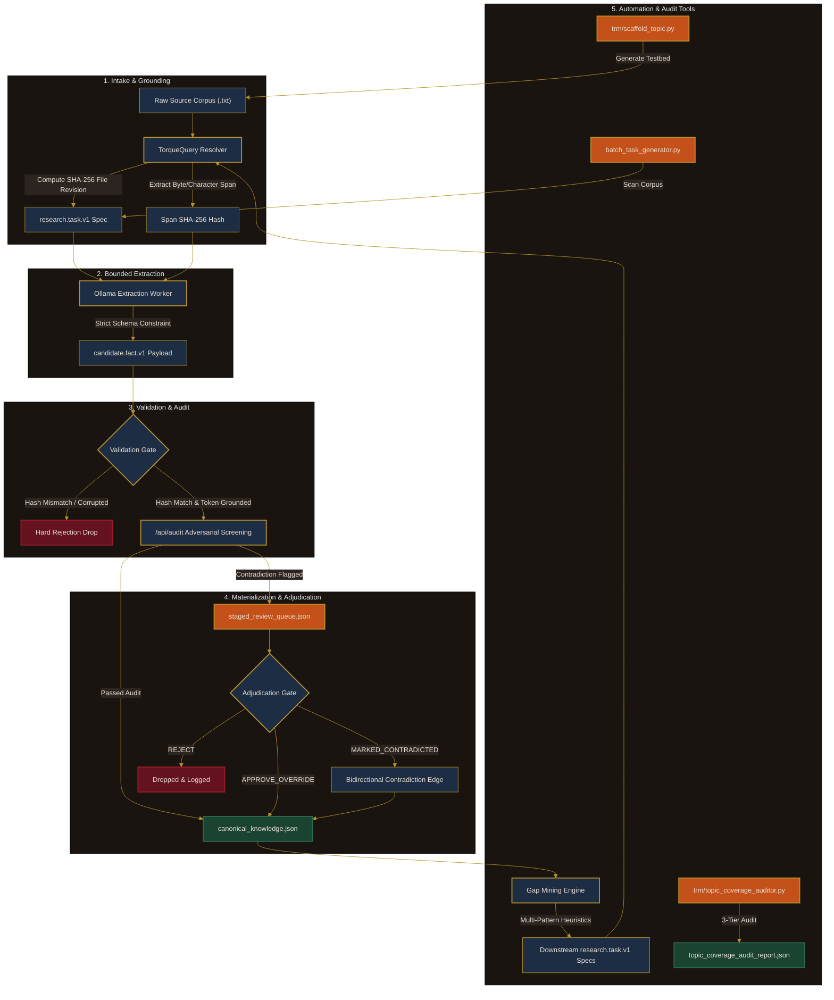

# Controlled evidence pipeline & TRM topic scaffolding

The controlled evidence pipeline is an end-to-end framework for extracting grounded factual claims from primary source text documents without risking unanchored LLM hallucination. All candidate claims are bound to immutable document revisions and exact character span SHA-256 hashes.

## End-to-end architecture workflow diagram



---

## Core components & audit enforcement

| Component | Entry Point | Enforcement Mechanism |
| --- | --- | --- |
| **TorqueQuery Resolver** | [`torque_span_resolver.py`](file:///c:/dev/tests/pilots/willow-run-1941/torque_span_resolver.py) | Calculates source file revision and character span SHA-256 hashes. |
| **Bounded Extractor** | [`ollama_bounded_extractor.py`](file:///c:/dev/tests/pilots/willow-run-1941/ollama_bounded_extractor.py) | Constrains LLM extraction strictly to validated text spans. |
| **Validation Gate** | [`validation_gate.py`](file:///c:/dev/tests/pilots/willow-run-1941/validation_gate.py) | Performs cryptographic span hash verification and idempotency check. |
| **Adversarial Audit** | [`staged_review_audit.py`](file:///c:/dev/tests/pilots/willow-run-1941/staged_review_audit.py) | Screens candidates against canonical records for temporal/spatial conflicts. |
| **Adjudication Gate** | [`adjudication_gate.py`](file:///c:/dev/tests/pilots/willow-run-1941/adjudication_gate.py) | Supports `APPROVE_OVERRIDE`, `MARKED_CONTRADICTED`, and `REJECT` actions. |
| **Gap Mining Engine** | [`gap_mining_engine.py`](file:///c:/dev/tests/pilots/willow-run-1941/gap_mining_engine.py) | Evaluates 4 heuristic rules: parameters, vendors, contracts, and production volume. |
| **Batch Task Generator** | [`batch_task_generator.py`](file:///c:/dev/tests/pilots/willow-run-1941/batch_task_generator.py) | Scans primary corpus accessions to generate batch `research.task.v1` specs. |
| **Topic Generator CLI** | [`trm/scaffold_topic.py`](file:///c:/dev/trm/scaffold_topic.py) | Scaffolds topic testbeds, corpus paths, task specs, and 7 Python modules. |
| **Topic Coverage Auditor** | [`trm/topic_coverage_auditor.py`](file:///c:/dev/trm/topic_coverage_auditor.py) | Runs 3-tier audits: orphan source detection, topic emergence, and scope drift. |

---

## Execution commands

To run topic scaffolding:
```bash
python trm/scaffold_topic.py --topic-slug <topic-slug>
```

To run topic coverage audits:
```bash
python trm/topic_coverage_auditor.py \
    --topics-dir ./tests/pilots \
    --corpus-dir ./tests/pilots/willow-run-1941/corpus \
    --report trm/topic_coverage_audit_report.json
```

To run the complete pilot feedback loop and batch ingestion runner:
```bash
python tests/pilots/willow-run-1941/run_feedback_loop.py
python tests/pilots/willow-run-1941/run_batch_ingestion.py
```
