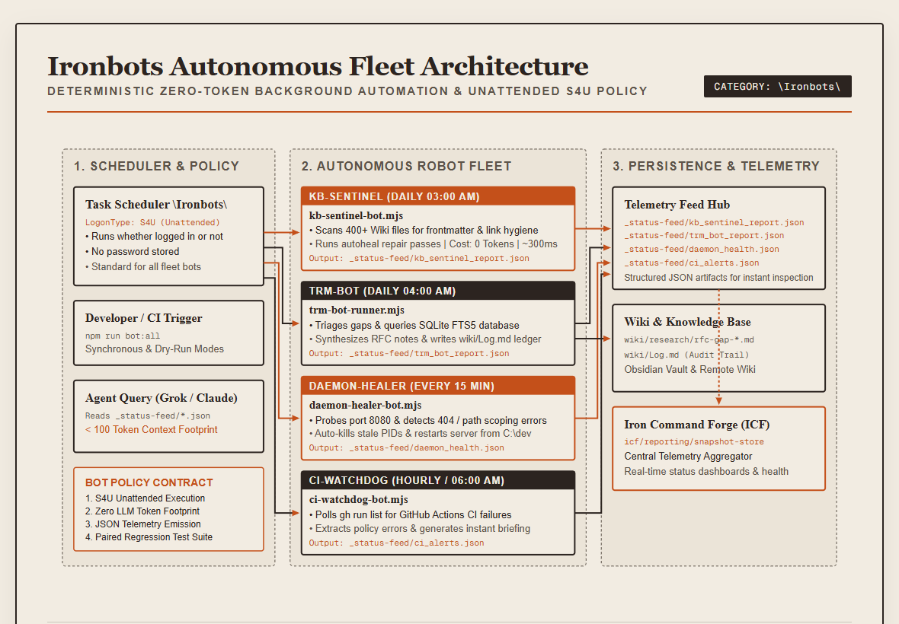
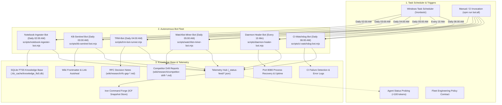

# Ironbots autonomous bot architecture & policy

Ironbots is the automated, zero-token background robot fleet in Toolforge and Iron Command Forge designed to maintain repository health, supervise background daemons, audit CI workflows, triage Topic Research Mining (TRM) research gaps, index knowledge into SQLite FTS5, and track competitor drift.



<details>
<summary>Mermaid source...</summary>



</details>

---

## Mandatory Ironbots engineering policy

All background automation bots added to the `\Ironbots\` fleet must strictly comply with the following four governance rules:

1. **Unattended execution (S4U)**:
   - Every bot must provide a PowerShell scheduled task wrapper (`scripts/schedule-task-wrapper-*.ps1`) registered under Task Scheduler folder `\Ironbots\`.
   - Principal must use Service-for-User (`-LogonType S4U`) so tasks execute 24/7 whether the user is logged on or not, without storing passwords.
2. **Zero-token deterministic computation**:
   - High-throughput scans (filesystem traversals, regex parsing, SQLite FTS5 queries, process probing) must run locally on the CPU without invoking LLM completions.
   - LLMs may only be queried for final text synthesis where deterministic AST/regex logic is insufficient.
3. **Structured JSON telemetry emission**:
   - Every bot run must write a structured, machine-readable JSON artifact to `_status-feed/<bot>_report.json`.
   - Telemetry must include `timestamp`, `elapsedMs`, `status`, and granular operational metrics.
4. **Paired regression test requirement**:
   - To satisfy the CI Delivery Guard policy (`CIC-GOVERNANCE/packages/delivery-guard`), every bot script and wrapper in `scripts/` must be paired with automated regression tests in `tests/ironbots.test.mjs`.

---

## Active bot roster

### 1. NotebookLM & Knowledge Ingester Bot
- **Script**: `scripts/notebook-ingester-bot.mjs`
- **Schedule**: Daily at 02:00 AM (`\Ironbots\Notebook-Ingester`)
- **Wrapper**: `scripts/schedule-task-wrapper-Notebook-Ingester.ps1`
- **Telemetry**: `_status-feed/notebook_ingester_report.json`
- **Function**: Ingests markdown wiki nodes, research packs, and PDF documents into a local SQLite FTS5 index (`.kb_cache/knowledge_fts5.db`) with SHA-256 change detection for fast, zero-token contextual retrieval.

---

### 2. KB-Sentinel Bot
- **Script**: `scripts/kb-sentinel-bot.mjs`
- **Schedule**: Daily at 03:00 AM (`\Ironbots\KB-Sentinel`)
- **Wrapper**: `scripts/schedule-task-wrapper-KB-Sentinel.ps1`
- **Telemetry**: `_status-feed/kb_sentinel_report.json`
- **Function**: Scans 400+ wiki entities for frontmatter validity, checks `[[Wikilink]]` integrity, computes health score (0–100), and performs automated link healing.

---

### 3. TRM Gap Triage & RFC Drafter Bot
- **Script**: `scripts/trm-bot-runner.mjs`
- **Schedule**: Daily at 04:00 AM (`\Ironbots\TRM-Bot`)
- **Wrapper**: `scripts/schedule-task-wrapper-TRM-Bot.ps1`
- **Telemetry**: `_status-feed/trm_bot_report.json`
- **Function**: Evaluates open research gaps in `kb-sync/trm-research-gaps.md`, queries local SQLite FTS5 database (`.kb_cache/knowledge_fts5.db`), drafts structured RFC notes in `wiki/research/rfc-gap-*.md`, and writes SHA-256 audit logs to `wiki/Log.md`.

---

### 4. Watchlist & Competitor Drift Miner Bot
- **Script**: `scripts/watchlist-miner-bot.mjs`
- **Schedule**: Daily at 05:00 AM (`\Ironbots\Watchlist-Miner`)
- **Wrapper**: `scripts/schedule-task-wrapper-Watchlist-Miner.ps1`
- **Telemetry**: `_status-feed/watchlist_miner_report.json`
- **Function**: Tracks model specifications, open-source repositories, and external frameworks defined in `kb-sync/core/competitor_watchlist.json`. Detects SHA-256 fingerprint drift and drafts architectural alert notes in `wiki/research/competitor-drift-*.md`.

---

### 5. Daemon-Healer Bot
- **Script**: `scripts/daemon-healer-bot.mjs`
- **Schedule**: Repeating every 15 minutes (`\Ironbots\Daemon-Healer`)
- **Wrapper**: `scripts/schedule-task-wrapper-Daemon-Healer.ps1`
- **Telemetry**: `_status-feed/daemon_health.json`
- **Function**: Continuously probes `http://127.0.0.1:8080/modules/wiki/dashboard.html`. If the server is dead, unresponsive, or returning `404`, it kills stale processes on port 8080 and restarts the HTTP server rooted at `C:\dev`.

---

### 6. CI-Watchdog Bot
- **Script**: `scripts/ci-watchdog-bot.mjs`
- **Schedule**: Daily at 06:00 AM / On-demand (`\Ironbots\CI-Watchdog`)
- **Wrapper**: `scripts/schedule-task-wrapper-CI-Watchdog.ps1`
- **Telemetry**: `_status-feed/ci_alerts.json`
- **Function**: Polls recent GitHub Actions workflow runs via `gh` CLI, detects failed runs, extracts policy or build error snippets, and creates an instant remediation summary.

---

## Operational CLI commands

### Run fleet synchronously
```bash
# Run all 6 bots sequentially
npm run bot:all

# Run individual bots
npm run bot:notebook:ingest
npm run bot:kb:sentinel
npm run bot:trm:triage
npm run bot:watchlist:mine
npm run bot:daemon:heal
npm run bot:ci:watchdog
```

### Windows Task Scheduler administration
```powershell
# Inspect all Ironbots tasks in Task Scheduler
Get-ScheduledTask -TaskPath "\Ironbots\"

# Check status of any bot
pwsh -NoProfile -File scripts/schedule-task-wrapper-Notebook-Ingester.ps1 -Action Status
pwsh -NoProfile -File scripts/schedule-task-wrapper-KB-Sentinel.ps1 -Action Status
pwsh -NoProfile -File scripts/schedule-task-wrapper-TRM-Bot.ps1 -Action Status
pwsh -NoProfile -File scripts/schedule-task-wrapper-Watchlist-Miner.ps1 -Action Status
pwsh -NoProfile -File scripts/schedule-task-wrapper-Daemon-Healer.ps1 -Action Status
pwsh -NoProfile -File scripts/schedule-task-wrapper-CI-Watchdog.ps1 -Action Status

# Register / Upgrade all to Unattended S4U Mode (Run in Administrator PowerShell)
pwsh -NoProfile -File scripts/schedule-task-wrapper-Notebook-Ingester.ps1 -Action Register -Unattended -Force
pwsh -NoProfile -File scripts/schedule-task-wrapper-KB-Sentinel.ps1 -Action Register -Unattended -Force
pwsh -NoProfile -File scripts/schedule-task-wrapper-TRM-Bot.ps1 -Action Register -Unattended -Force
pwsh -NoProfile -File scripts/schedule-task-wrapper-Watchlist-Miner.ps1 -Action Register -Unattended -Force
pwsh -NoProfile -File scripts/schedule-task-wrapper-Daemon-Healer.ps1 -Action Register -Unattended -Force
pwsh -NoProfile -File scripts/schedule-task-wrapper-CI-Watchdog.ps1 -Action Register -Unattended -Force
```

---

## Related entities

- [[Index]]
- [[ControlledEvidencePipeline]]
- [[research/trm-devops-triage-pipeline|trm-devops-triage-pipeline]]
- [[research/whichllm-model-selection-evaluator|whichllm-model-selection-evaluator]]
