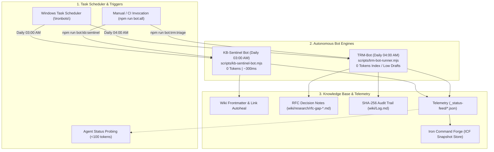

# Ironbots autonomous bot architecture

Ironbots is the automated, zero-token background robot fleet in Toolforge designed to handle maintenance, knowledge base health checks, and Topic Research Mining (TRM) gap triaging.


<details>
<summary>Mermaid source...</summary>



</details>

---

## Overview and design philosophy

Running deep markdown traversals, broken-link audits, and archival text matching inside LLM context windows wastes context capacity and exhausts API quotas. Ironbots offloads these workloads to deterministic local scripts managed directly by Windows Task Scheduler under the dedicated folder `\Ironbots\`.

### Key principles

1. **Zero-token execution**: Parsing 400+ markdown files, verifying frontmatter schemas, and checking wikilinks execute on the host CPU in under 350 milliseconds without consuming LLM tokens.
2. **Unattended execution (S4U)**: Tasks run whether the user is logged on or not using Service-for-User (`S4U`) logon credentials.
3. **Structured telemetry**: Every bot run generates a timestamped JSON telemetry report in `_status-feed/` for instant inspection by human developers or AI agents.

---

## Bot roster

### 1. KB-Sentinel Bot

- **Script**: `scripts/kb-sentinel-bot.mjs`
- **Schedule**: Daily at 03:00 AM
- **Task Path**: `\Ironbots\KB-Sentinel`
- **Wrapper**: `scripts/schedule-task-wrapper-KB-Sentinel.ps1`
- **Telemetry**: `_status-feed/kb_sentinel_report.json`

#### Core responsibilities
- Recursively scans all wiki files in `wiki/**/*.md` and `kb-sync/`.
- Validates YAML frontmatter presence and schema conformance.
- Checks `[[Wikilink]]` targets against the global document index.
- Computes a global health score (0–100) and writes structured diagnostics.
- Executes safe, deterministic autohealing passes when invoked with `--fix`.

---

### 2. TRM Gap Triage & RFC Drafter Bot

- **Script**: `scripts/trm-bot-runner.mjs`
- **Schedule**: Daily at 04:00 AM
- **Task Path**: `\Ironbots\TRM-Bot`
- **Wrapper**: `scripts/schedule-task-wrapper-TRM-Bot.ps1`
- **Telemetry**: `_status-feed/trm_bot_report.json`

#### Core responsibilities
- Parses the active research gaps registry in `kb-sync/trm-research-gaps.md`.
- Matches un-drafted research gaps against topic context in the local SQLite database (`.kb_cache/knowledge.db`).
- Synthesizes structured RFC markdown decision notes in `wiki/research/rfc-gap-*.md`.
- Appends immutable audit records with timestamps to `wiki/Log.md`.

---

## CLI and operational workflows

### On-demand execution

To run the bots manually from the repository root:

```bash
# Run both bots sequentially
npm run bot:all

# Run KB-Sentinel only
npm run bot:kb:sentinel

# Run TRM-Bot only
npm run bot:trm:triage
```

### Windows Task Scheduler management

```powershell
# Check current status of Ironbots tasks
pwsh -NoProfile -File scripts/schedule-task-wrapper-KB-Sentinel.ps1 -Action Status
pwsh -NoProfile -File scripts/schedule-task-wrapper-TRM-Bot.ps1 -Action Status

# Test bot execution directly via wrapper
pwsh -NoProfile -File scripts/schedule-task-wrapper-KB-Sentinel.ps1 -Action Test
pwsh -NoProfile -File scripts/schedule-task-wrapper-TRM-Bot.ps1 -Action Test

# Register or upgrade to unattended mode (Run as Administrator)
pwsh -NoProfile -File scripts/schedule-task-wrapper-KB-Sentinel.ps1 -Action Register -Unattended -Force
pwsh -NoProfile -File scripts/schedule-task-wrapper-TRM-Bot.ps1 -Action Register -Unattended -Force
```

---

## Related entities

- [[Index]]
- [[ControlledEvidencePipeline]]
- [[research/trm-devops-triage-pipeline|trm-devops-triage-pipeline]]
- [[research/whichllm-model-selection-evaluator|whichllm-model-selection-evaluator]]
