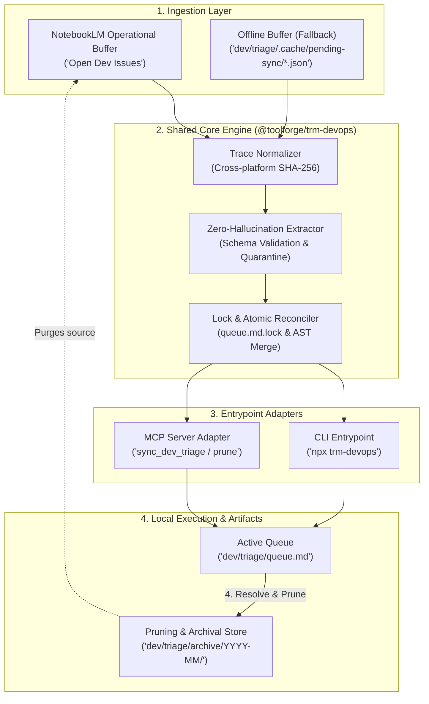

# Property Profile: Cuban Commercial Asset

## Core Metadata
- **Parcel/Asset Name:** Cuban Commercial Asset
- **Corporate Parent:** ---
title: "TRM DevOps Sync & Triage Pipeline Architecture"
category: "architecture"
topic: "trm-devops-triage"
created_at: "2026-08-28T18:25:00Z"
tags: ["trm", "devops", "triage", "architecture", "notebooklm", "concurrency"]
---

# TRM DevOps Sync & Triage Pipeline Architecture

The **TRM DevOps Sync & Triage Pipeline** adapts the Topic Research Mining (TRM) pattern to developer operations. It continuously ingests diagnostic logs, CI failure traces, and GitHub Actions telemetry into a structured NotebookLM operational buffer (`[Open Dev Issues]`), extracts actionable defect models, and reconciles them into local Markdown triage queues with bi-directional human note preservation.

---

## System architecture topology


<details>
<summary>Mermaid source...</summary>



</details>

---

## Architecture layers

### 1. Ingestion layer
- **NotebookLM operational buffer**: Holds unstructured diagnostic threads, stack traces, and workflow run outputs.
- **Offline pending buffer (`dev/triage/.cache/pending-sync/`)**: Stores staged JSON payloads locally when offline, drained seamlessly during sync cycles.

### 2. Shared core engine (`modules/trm-devops/src/core`)
- **Trace normalizer (`normalizer.ts`)**: Generates deterministic, cross-platform SHA-256 signatures by stripping ANSI escape codes, container UUIDs, execution durations, and OS-specific line breaks (`\r\n` vs `\n`).
- **Zero-hallucination extractor (`extractor.ts`)**: Enforces strict `DefectItem` schema validation. Malformed or hallucinated chunks are isolated into `.cache/quarantine/` without failing the sync batch.
- **Concurrency lock manager (`lock.ts`)**: Manages `queue.md.lock` leases with PID and hostname verification, exponential backoff (50ms to 1000ms), and 30-second stale-lock auto-recovery.
- **Atomic queue reconciler (`reconciler.ts`)**: Performs bi-directional AST reconciliation, preserving human operator notes inside `<!-- operator-notes-start -->` blocks across automated synchronizations. Writes use temporary files followed by atomic renames.
- **Archival & pruning engine (`pruning.ts`)**: Relocates `RESOLVED` defects to monthly archive documents (`dev/triage/archive/YYYY-MM/resolved-defects.md`), appends duration metrics to `archive/index.json`, and triggers remote source deletion.

### 3. Entrypoint adapters
- **CLI (`src/cli/index.ts`)**: Provides `trm-devops sync`, `trm-devops prune`, and `trm-devops status` commands for terminal and cron automation.
- **MCP Server (`src/mcp/server.ts`)**: Exposes structured JSON-RPC tools (`sync_dev_triage`, `prune_triage_source`, `query_dev_notebook`) for AI pair programmers and agents.

---

## 4-Step operator lifecycle

```
┌────────────────────┐     ┌───────────────────────┐     ┌────────────────────────┐     ┌─────────────────────┐
│ 1. Inspect queue   │ ──> │ 2. Claim & run steps  │ ──> │ 3. Annotate notes      │ ──> │ 4. Resolve & prune  │
│ dev/triage/queue.md│     │ gh / pwsh / npm test  │     │ status: IN_PROGRESS    │     │ npx trm-devops prune│
└────────────────────┘     └───────────────────────┘     └────────────────────────┘     └─────────────────────┘
```

1. **Inspect & claim**: Open `dev/triage/queue.md`, assign owner, and set status to `IN_PROGRESS`.
2. **Execute steps**: Run extracted deterministic diagnostic commands (e.g. `gh run view --log-failed`).
3. **Verify fix**: Apply code or infrastructure changes, run `npm test`, and push verification commits.
4. **Resolve & prune**: Mark defect status `RESOLVED` and execute `npx trm-devops prune` to archive locally and clean up the remote NotebookLM buffer.
- **Location / Province:** N/A
- **Area:** N/A
- **Seizure Decree:** ---
title: "TRM DevOps Sync & Triage Pipeline Architecture"
category: "architecture"
topic: "trm-devops-triage"
created_at: "2026-08-28T18:25:00Z"
tags: ["trm", "devops", "triage", "architecture", "notebooklm", "concurrency"]
---

# TRM DevOps Sync & Triage Pipeline Architecture

The **TRM DevOps Sync & Triage Pipeline** adapts the Topic Research Mining (TRM) pattern to developer operations. It continuously ingests diagnostic logs, CI failure traces, and GitHub Actions telemetry into a structured NotebookLM operational buffer (`[Open Dev Issues]`), extracts actionable defect models, and reconciles them into local Markdown triage queues with bi-directional human note preservation.

---

## System architecture topology


<details>
<summary>Mermaid source...</summary>


</details>

---

## Architecture layers

### 1. Ingestion layer
- **NotebookLM operational buffer**: Holds unstructured diagnostic threads, stack traces, and workflow run outputs.
- **Offline pending buffer (`dev/triage/.cache/pending-sync/`)**: Stores staged JSON payloads locally when offline, drained seamlessly during sync cycles.

### 2. Shared core engine (`modules/trm-devops/src/core`)
- **Trace normalizer (`normalizer.ts`)**: Generates deterministic, cross-platform SHA-256 signatures by stripping ANSI escape codes, container UUIDs, execution durations, and OS-specific line breaks (`\r\n` vs `\n`).
- **Zero-hallucination extractor (`extractor.ts`)**: Enforces strict `DefectItem` schema validation. Malformed or hallucinated chunks are isolated into `.cache/quarantine/` without failing the sync batch.
- **Concurrency lock manager (`lock.ts`)**: Manages `queue.md.lock` leases with PID and hostname verification, exponential backoff (50ms to 1000ms), and 30-second stale-lock auto-recovery.
- **Atomic queue reconciler (`reconciler.ts`)**: Performs bi-directional AST reconciliation, preserving human operator notes inside `<!-- operator-notes-start -->` blocks across automated synchronizations. Writes use temporary files followed by atomic renames.
- **Archival & pruning engine (`pruning.ts`)**: Relocates `RESOLVED` defects to monthly archive documents (`dev/triage/archive/YYYY-MM/resolved-defects.md`), appends duration metrics to `archive/index.json`, and triggers remote source deletion.

### 3. Entrypoint adapters
- **CLI (`src/cli/index.ts`)**: Provides `trm-devops sync`, `trm-devops prune`, and `trm-devops status` commands for terminal and cron automation.
- **MCP Server (`src/mcp/server.ts`)**: Exposes structured JSON-RPC tools (`sync_dev_triage`, `prune_triage_source`, `query_dev_notebook`) for AI pair programmers and agents.

---

## 4-Step operator lifecycle

```
┌────────────────────┐     ┌───────────────────────┐     ┌────────────────────────┐     ┌─────────────────────┐
│ 1. Inspect queue   │ ──> │ 2. Claim & run steps  │ ──> │ 3. Annotate notes      │ ──> │ 4. Resolve & prune  │
│ dev/triage/queue.md│     │ gh / pwsh / npm test  │     │ status: IN_PROGRESS    │     │ npx trm-devops prune│
└────────────────────┘     └───────────────────────┘     └────────────────────────┘     └─────────────────────┘
```

1. **Inspect & claim**: Open `dev/triage/queue.md`, assign owner, and set status to `IN_PROGRESS`.
2. **Execute steps**: Run extracted deterministic diagnostic commands (e.g. `gh run view --log-failed`).
3. **Verify fix**: Apply code or infrastructure changes, run `npm test`, and push verification commits.
4. **Resolve & prune**: Mark defect status `RESOLVED` and execute `npx trm-devops prune` to archive locally and clean up the remote NotebookLM buffer.
- **FCSC Claim Number:** N/A
- **Principal Valuation:** N/A

## Extraction Quality & Confidence
- **Confidence Score:** 0.65
- **Missing Fields:** FCSC Claim Number, Principal Valuation, Province / Location, Area (Acreage/Caballerías)

## Cross-References
- **Thematic Target:** CIC - Cuban Seizures & Retired Assets
- **Decree Basis:** ---
title: "TRM DevOps Sync & Triage Pipeline Architecture"
category: "architecture"
topic: "trm-devops-triage"
created_at: "2026-08-28T18:25:00Z"
tags: ["trm", "devops", "triage", "architecture", "notebooklm", "concurrency"]
---

# TRM DevOps Sync & Triage Pipeline Architecture

The **TRM DevOps Sync & Triage Pipeline** adapts the Topic Research Mining (TRM) pattern to developer operations. It continuously ingests diagnostic logs, CI failure traces, and GitHub Actions telemetry into a structured NotebookLM operational buffer (`[Open Dev Issues]`), extracts actionable defect models, and reconciles them into local Markdown triage queues with bi-directional human note preservation.

---

## System architecture topology


<details>
<summary>Mermaid source...</summary>


</details>

---

## Architecture layers

### 1. Ingestion layer
- **NotebookLM operational buffer**: Holds unstructured diagnostic threads, stack traces, and workflow run outputs.
- **Offline pending buffer (`dev/triage/.cache/pending-sync/`)**: Stores staged JSON payloads locally when offline, drained seamlessly during sync cycles.

### 2. Shared core engine (`modules/trm-devops/src/core`)
- **Trace normalizer (`normalizer.ts`)**: Generates deterministic, cross-platform SHA-256 signatures by stripping ANSI escape codes, container UUIDs, execution durations, and OS-specific line breaks (`\r\n` vs `\n`).
- **Zero-hallucination extractor (`extractor.ts`)**: Enforces strict `DefectItem` schema validation. Malformed or hallucinated chunks are isolated into `.cache/quarantine/` without failing the sync batch.
- **Concurrency lock manager (`lock.ts`)**: Manages `queue.md.lock` leases with PID and hostname verification, exponential backoff (50ms to 1000ms), and 30-second stale-lock auto-recovery.
- **Atomic queue reconciler (`reconciler.ts`)**: Performs bi-directional AST reconciliation, preserving human operator notes inside `<!-- operator-notes-start -->` blocks across automated synchronizations. Writes use temporary files followed by atomic renames.
- **Archival & pruning engine (`pruning.ts`)**: Relocates `RESOLVED` defects to monthly archive documents (`dev/triage/archive/YYYY-MM/resolved-defects.md`), appends duration metrics to `archive/index.json`, and triggers remote source deletion.

### 3. Entrypoint adapters
- **CLI (`src/cli/index.ts`)**: Provides `trm-devops sync`, `trm-devops prune`, and `trm-devops status` commands for terminal and cron automation.
- **MCP Server (`src/mcp/server.ts`)**: Exposes structured JSON-RPC tools (`sync_dev_triage`, `prune_triage_source`, `query_dev_notebook`) for AI pair programmers and agents.

---

## 4-Step operator lifecycle

```
┌────────────────────┐     ┌───────────────────────┐     ┌────────────────────────┐     ┌─────────────────────┐
│ 1. Inspect queue   │ ──> │ 2. Claim & run steps  │ ──> │ 3. Annotate notes      │ ──> │ 4. Resolve & prune  │
│ dev/triage/queue.md│     │ gh / pwsh / npm test  │     │ status: IN_PROGRESS    │     │ npx trm-devops prune│
└────────────────────┘     └───────────────────────┘     └────────────────────────┘     └─────────────────────┘
```

1. **Inspect & claim**: Open `dev/triage/queue.md`, assign owner, and set status to `IN_PROGRESS`.
2. **Execute steps**: Run extracted deterministic diagnostic commands (e.g. `gh run view --log-failed`).
3. **Verify fix**: Apply code or infrastructure changes, run `npm test`, and push verification commits.
4. **Resolve & prune**: Mark defect status `RESOLVED` and execute `npx trm-devops prune` to archive locally and clean up the remote NotebookLM buffer.

=== PROVENANCE ===
source_path: C:/dev/wiki/research/trm-devops-triage-pipeline.md
source_type: md
hash_sha256: c8842b665140047d73f943ebb6a66c4c639a87c443a76b56aad19a5a1be4ceef
extracted_at: 2026-08-30T02:27:21.502Z
extractor_version: 2026-08-29-1
===================
