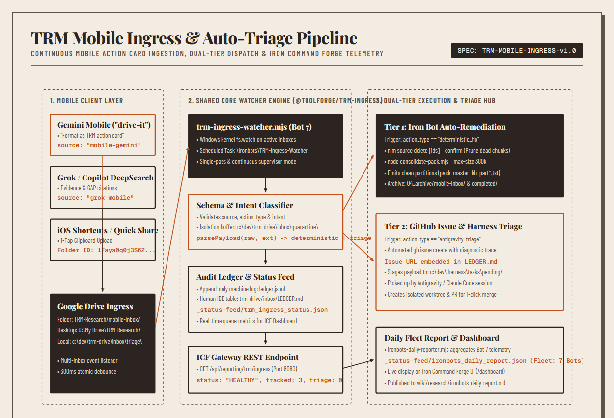
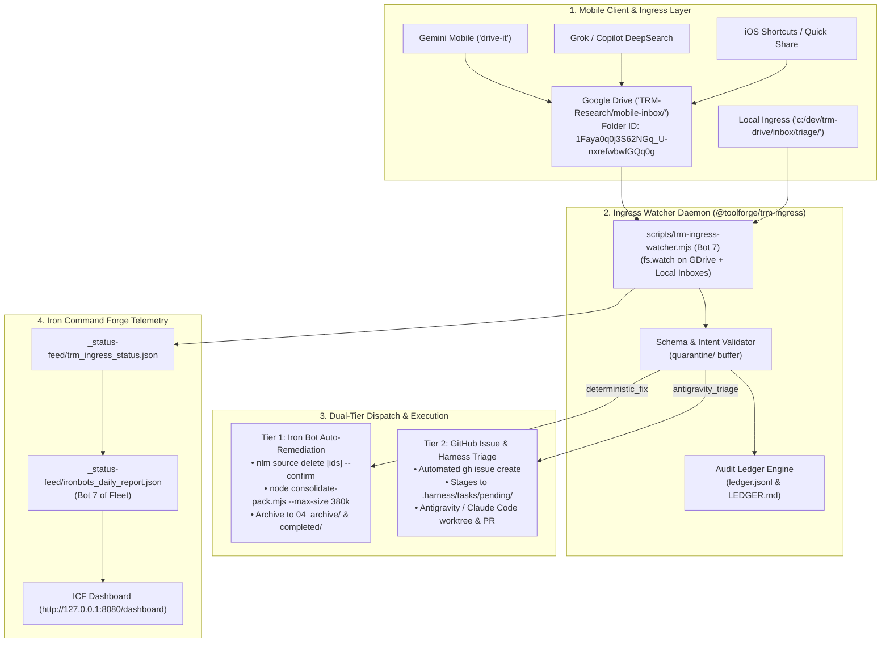

# TRM Mobile Ingress & Auto-Triage Pipeline Architecture

The **TRM Mobile Ingress & Auto-Triage Pipeline** enables zero-friction, 1-tap capture of research notes, defect models, roadmap items, and operational fixes from mobile devices (Gemini Mobile, Grok, Copilot, iOS Shortcuts, Android Quick Share) directly into the local Toolforge and Iron Command Forge ecosystem with dual-tier autonomous dispatch.

---

## System architecture topology



<details>
<summary>Mermaid source...</summary>



</details>

---

## Architecture layers

### 1. Mobile client & ingress layer
- **Mobile Interfaces**: Captures formatted action payloads from Gemini Mobile (`"drive-it"` prompt), Grok/Copilot DeepSearch, and native iOS Shortcuts / Android Quick Share.
- **Canonical Google Drive Ingress (`TRM-Research/mobile-inbox/`)**: Folder ID `1Faya0q0j3S62NGq_U-nxrefwbwfGQq0g` (mounted locally as `G:\My Drive\TRM-Research\mobile-inbox\`).
- **Local Workspace Staging (`c:/dev/trm-drive/inbox/triage/`)**: Direct offline and CLI testing staging directory.

### 2. Shared core watcher engine (`scripts/trm-ingress-watcher.mjs`)
- **Multi-Inbox Event Listener**: Employs Windows filesystem watching (`fs.watch`) across all active Google Drive and local inbox directories with a 300ms atomic debounce.
- **Schema & Intent Validator**: Enforces strict JSON and Markdown frontmatter validation (`source`, `action_type`, `intent`). Corrupted payloads are safely isolated into `quarantine/`.
- **Audit Ledger Engine**: Records every transition to machine log `c:/dev/trm-drive/inbox/ledger.jsonl` and dynamically regenerates the human IDE markdown table `c:/dev/trm-drive/inbox/LEDGER.md`.

### 3. Dual-tier dispatch & execution hub
- **Tier 1 (Deterministic Auto-Fix)**: When `action_type == "deterministic_fix"`, Iron Bots immediately execute automated CLI remediations (e.g. `nlm source delete [ids] --confirm`, `consolidate-pack.mjs --max-size 380k`) and archive originals to `04_archive/mobile-inbox/` and `completed/`.
- **Tier 2 (GitHub Issue & Agent Harness)**: When `action_type == "antigravity_triage"`, the daemon invokes `gh issue create` with full diagnostic traces, writes the live issue link into `LEDGER.md`, and stages the task into `.harness/tasks/pending/` for coding agents to implement via isolated worktrees and PRs.

### 4. Iron Command Forge telemetry integration
- **Status Feed Emitter**: Emits live queue counts and tracked history to `_status-feed/trm_ingress_status.json`.
- **Bot 7 Fleet Aggregator**: Ingested by `scripts/ironbots-daily-reporter.mjs` as Bot 7 of the fleet and displayed live on the ICF Dashboard (`http://127.0.0.1:8080/dashboard`).
- **Gateway REST Route**: Exposes `GET /api/reporting/trm/ingress` via `icf/src/server.mjs`.

---

## 4-Step operator lifecycle

```
┌────────────────────┐     ┌───────────────────────┐     ┌────────────────────────┐     ┌─────────────────────┐
│ 1. Mobile Drop     │ ──> │ 2. Ingress Watcher    │ ──> │ 3. Dispatch & Fix      │ ──> │ 4. Audit & Dashboard│
│ Phone / Shortcuts  │     │ fs.watch (300ms)      │     │ IronBot / GitHub Issue │     │ LEDGER.md / ICF UI  │
└────────────────────┘     └───────────────────────┘     └────────────────────────┘     └─────────────────────┘
```

1. **Mobile Drop**: Format assessment as an action card and drop to `TRM-Research/mobile-inbox/`.
2. **Ingress Watcher**: Ingress daemon picks up the card, validates schema, and determines execution tier.
3. **Dispatch & Fix**: Auto-heals deterministic defects or opens a tracked GitHub Issue and stages for agent coding.
4. **Audit & Dashboard**: Archives receipt, updates `LEDGER.md`, and broadcasts telemetry to Iron Command Forge.

---

## Ingress payload contracts

### Action Card Envelope (JSON)

```json
{
  "id": "act-20260926-154308",
  "timestamp": "2026-09-26T15:43:08Z",
  "source": "gemini-mobile",
  "target_notebook": "679b8bab-2d87-42cb-a726-6dc54c83acc2",
  "target_notebook_name": "CIC-KB",
  "domain": "master-kb",
  "intent": "remediate_quarantine_enobufs",
  "action_type": "deterministic_fix",
  "priority": "high",
  "summary": "Prune 6 dead ENOBUFS overflow sources in CIC-KB and repack unsorted items under KIS-P budget",
  "context": {
    "error": "spawnSync nlm ENOBUFS (Node buffer limit overflow on >1M token chunks)",
    "budget_rule": "KIS-P <= 380 KiB",
    "failed_sources": [
      {
        "displayName": "repo_knowledge_pack_part_ab.txt",
        "name": "notebooks/679b8bab-2d87-42cb-a726-6dc54c83acc2/sources/2977e2a0-c164-41ed-b53d-4517d0570fb1"
      }
    ]
  },
  "execution_plan": [
    {
      "step": 1,
      "handler": "iron_bot",
      "action": "batch_delete_sources",
      "target_ids": ["2977e2a0-c164-41ed-b53d-4517d0570fb1"]
    },
    {
      "step": 2,
      "handler": "iron_bot",
      "action": "consolidate_and_repack",
      "command": "node consolidate-pack.mjs --max-size 380k"
    }
  ]
}
```

---

## Operational CLI commands

```powershell
# Run single-pass sweep
pwsh -NoProfile -File scripts/schedule-task-wrapper-TRM-Ingress-Watcher.ps1

# Start continuous real-time background watcher
pwsh -NoProfile -File scripts/schedule-task-wrapper-TRM-Ingress-Watcher.ps1 -Continuous

# Check live queue metrics & audit ledger
pwsh -NoProfile -File scripts/get-trm-status.ps1
```

---

## Related entities

- [[Index]]
- [[Ironbots]]
- [[ControlledEvidencePipeline]]
- [[research/trm-devops-triage-pipeline|trm-devops-triage-pipeline]]
- [[research/ironbots-daily-report|ironbots-daily-report]]
