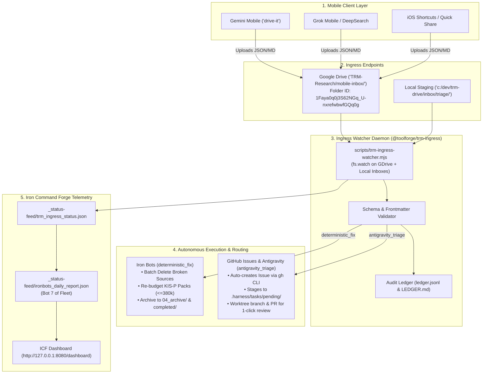

# TRM Mobile Ingress & Auto-Triage Pipeline

The **TRM Mobile Ingress & Auto-Triage Pipeline** enables zero-friction, 1-tap capture of research notes, defect reports, roadmap items, and operational fixes from mobile devices (Gemini Mobile, Grok, Copilot, iOS Shortcuts, Android Quick Share) directly into the local Toolforge and Iron Command Forge ecosystem.

---

## 1. Architecture Topology



---

## 2. Ingress Contracts & Schema

### Standard Action Envelope (JSON)

```json
{
  "id": "act-20260926-154308",
  "timestamp": "2026-09-26T15:43:08Z",
  "source": "gemini-mobile",
  "target_notebook": "679b8bab-2d87-42cb-a726-6dc54c83acc2",
  "target_notebook_name": "CIC-KB",
  "domain": "master-kb",
  "intent": "remediate_quarantine_enobufs",
  "action_type": "deterministic_fix",
  "priority": "high",
  "summary": "Prune dead ENOBUFS overflow sources in CIC-KB and repack unsorted items",
  "context": {
    "error": "spawnSync nlm ENOBUFS (Node buffer limit overflow on >1M token chunks)",
    "budget_rule": "KIS-P <= 380 KiB",
    "failed_sources": [
      "notebooks/679b8bab-2d87-42cb-a726-6dc54c83acc2/sources/2977e2a0-c164-41ed-b53d-4517d0570fb1"
    ]
  },
  "execution_plan": [
    {
      "step": 1,
      "handler": "iron_bot",
      "action": "batch_delete_sources",
      "target_ids": ["2977e2a0-c164-41ed-b53d-4517d0570fb1"]
    },
    {
      "step": 2,
      "handler": "iron_bot",
      "action": "consolidate_and_repack",
      "command": "node consolidate-pack.mjs --max-size 380k"
    }
  ]
}
```

### Action Types & Handlers

1. **`deterministic_fix`**:
   - Automated, zero-ambiguity tasks: batch source deletion via `nlm source delete --confirm`, knowledge pack consolidation under `<= 380 KiB` budget, and duplicate pruning.
   - Executed autonomously by the daemon, archived to `TRM-Research/04_archive/mobile-inbox/` and `c:/dev/trm-drive/inbox/completed/`.

2. **`antigravity_triage`**:
   - Architecture choices, code bug fixes, or feature roadmaps requiring human/agent code reviews.
   - Automatically generates a tracked GitHub Issue via `gh issue create`, logs the live issue URL in `LEDGER.md`, and stages the task into `c:/dev/.harness/tasks/pending/`.

---

## 3. Storage & Monitored Paths

| Location | Path | Role |
|---|---|---|
| **Google Drive Cloud** | `TRM-Research/mobile-inbox/` (`Folder ID: 1Faya0q0j3S62NGq_U-nxrefwbwfGQq0g`) | Primary mobile drop point |
| **Desktop Google Drive** | `G:\My Drive\TRM-Research\mobile-inbox\` | Live synced local mount |
| **Local Staging** | `c:\dev\trm-drive\inbox\triage\` | Direct offline/CLI drop point |
| **Completed Archive** | `G:\My Drive\TRM-Research\04_archive\mobile-inbox\` & `c:\dev\trm-drive\inbox\completed\` | Long-term receipt store |
| **Quarantine Buffer** | `c:\dev\trm-drive\inbox\quarantine\` | Invalid/malformed schema payloads |
| **Agent Pending** | `c:\dev\.harness\tasks\pending\` | Staged for Antigravity / Claude Code |
| **Tracking Ledger** | `c:\dev\trm-drive\inbox\LEDGER.md` & `ledger.jsonl` | Real-time audit log |

---

## 4. Operational Commands

- **Run Single Sweep**:
  ```powershell
  powershell -File scripts/schedule-task-wrapper-TRM-Ingress-Watcher.ps1
  ```
- **Run Continuous Background Watcher**:
  ```powershell
  powershell -File scripts/schedule-task-wrapper-TRM-Ingress-Watcher.ps1 -Continuous
  ```
- **Check Ingress & Fleet Status**:
  ```powershell
  powershell -File scripts/get-trm-status.ps1
  ```
- **Inspect ICF Dashboard**:
  Browse to `http://127.0.0.1:8080/dashboard` or query `http://127.0.0.1:8080/api/reporting/trm/ingress`.
