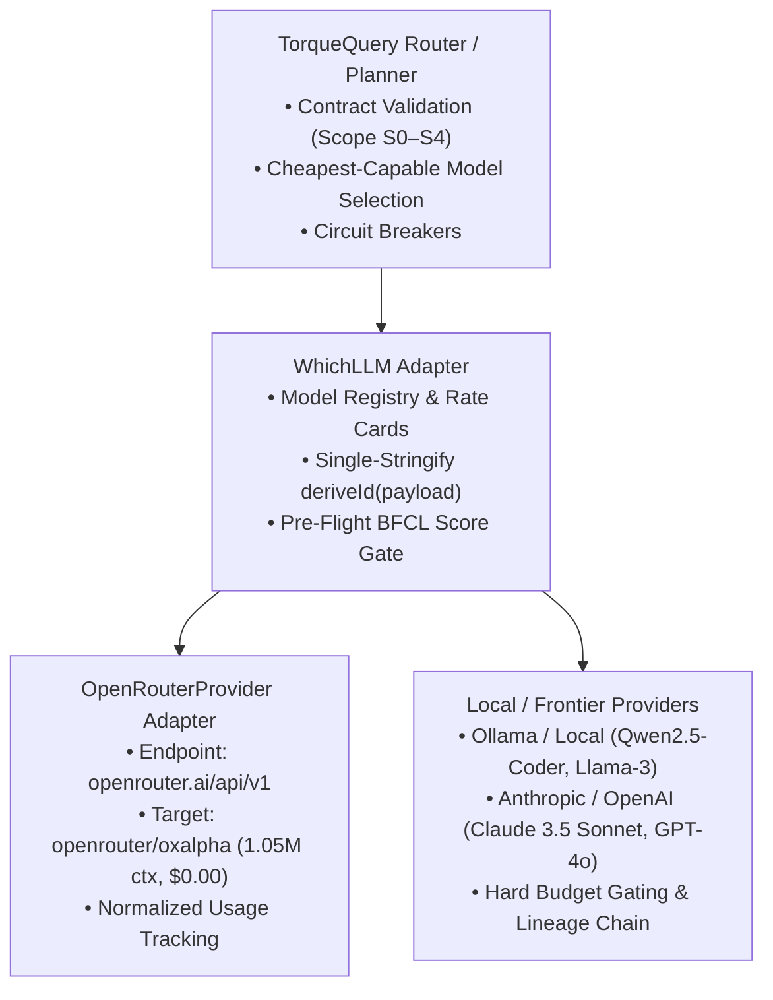

# WhichLLM v2.4.0 Model Selection & OpenRouter Evaluator

## Architecture & Purpose

The WhichLLM automated model selection matrix evaluates open-weight local and cloud-hosted LLMs for grounded tool execution, model routing, and local RAG synthesis within the CIC agent mesh and TorqueQuery pipeline.

Mermaid source...

---

## Core Disciplines & Pre-Flight BFCL Gate

Before any model (local or cloud-hosted) is granted tool-calling authority in TorqueQuery, it must pass the Berkeley Function Calling Benchmark (`whichllm-bfcl-evaluator.py`) suite across four mandatory disciplines:

1. **Simple Tool Calls** (`bfcl-cic-001-simple-read`): Invoking single-tool materializers with exact arguments.
2. **Parallel Tool Calls** (`bfcl-cic-002-parallel-dispatch`): Dispatching non-overlapping concurrent requests.
3. **Nested Tool Calls** (`bfcl-cic-003-nested-resolver`): Resolving chained execution dependencies across components.
4. **Negative Relevance Rejections** (`bfcl-cic-004-relevance-rejection`): Refusing tool invocation on non-tool queries.

### Acceptance Threshold
* **`composite_bfcl_score >= 0.85`**: Granted full tool-calling authority (`S0`–`S4`).
* **`composite_bfcl_score < 0.85`**: Restricted to read/summarize-only (`S0`/`S1`) with `max_tool_calls: 0`.

---

## OpenRouter Preview Model Registry: Ox Alpha (`openrouter/oxalpha`)

Ox Alpha is integrated as a Tier 0 preview model under the OpenRouter provider adapter.

| Parameter | Specification |
| :--- | :--- |
| **Canonical Model ID** | `openrouter/oxalpha` |
| **API Target Slug** | `oxalpha` |
| **Context Window** | 1,050,000 tokens |
| **Max Output Tokens** | 131,072 tokens |
| **Rate Card Version** | `openrouter-free-2026-08` |
| **Input Cost / 1M** | $0.00 |
| **Output Cost / 1M** | $0.00 |
| **Tier** | `tier0_preview` |

---

## Governance & Invariants (§2/S3-A1)

1. **Deterministic Lineage Hashing**: Both local and OpenRouter execution branches compute `requestHash` directly from unstringified payload objects via `deriveId(payload)`, guaranteeing:
   $$\text{requestPayloadHash} \equiv \text{SHA256}(\text{wireBytes})$$
2. **Model Allowlist (GC-04)**: Enforces `openrouter/`, `oxalpha`, and `anthropic/claude` namespace prefixes in `GovernanceWrapper`.
3. **Server-Controlled Prompt Cap (GC-03)**: Governed via `#maxPromptBytes` set in `GovernanceWrapper` constructor options (`opts.maxPromptBytes`), preventing untrusted caller overrides.
