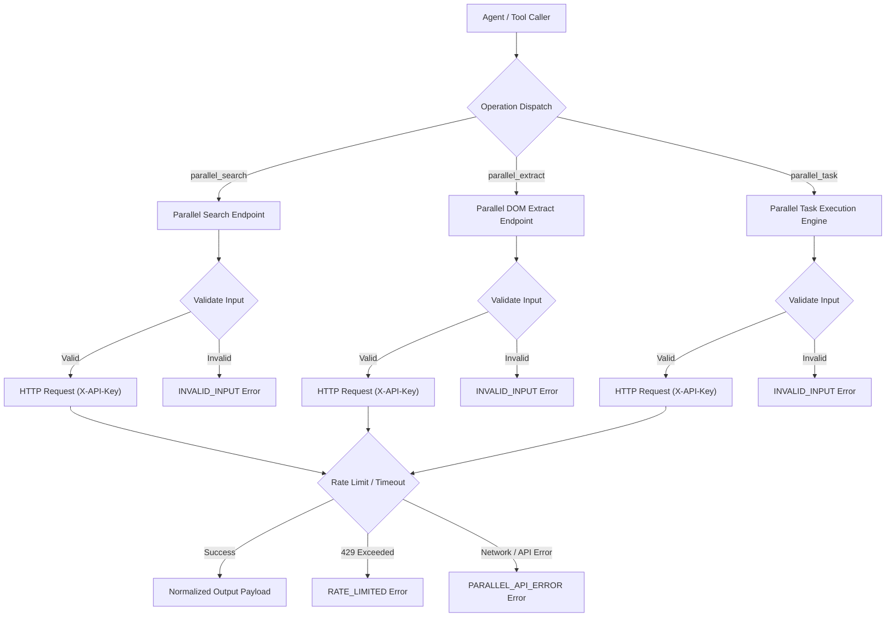

# Parallel Search integration

The `parallel-search` skill provides structured web discovery, DOM extraction, and queued research task dispatch through the Parallel API. All operations fail closed without throwing exceptions, returning deterministic `{ ok: true, data }` or `{ ok: false, error }` result payloads.

## Architecture and data flow

```text
Caller
  │
  ├─► parallel_search  ──► Parallel Search API ─► SearchOutput
  ├─► parallel_extract ──► Parallel Extract API ─► ExtractOutput
  └─► parallel_task    ──► Parallel Task API   ─► TaskOutput
```

<details>
<summary>Mermaid source</summary>


</details>

## Operations and interfaces

To invoke `parallel-search` programmatically, import functions from `skills/parallel-search/dist/index.js`:

1. **`parallel_search(input, options?)`**: Performs web search queries and returns ranked search results with URLs, titles, and snippets.
2. **`parallel_extract(input, options?)`**: Extracts structured page content and DOM text from specified URLs.
3. **`parallel_task(input, options?)`**: Queues deep agentic multi-turn research tasks and tracks execution status.

## Configuration and authentication

To configure credentials via environment variables, set:
```bash
export PARALLEL_API_KEY="your-parallel-api-key"
```

To pass credentials on a per-request basis, supply `apiKey` within `RuntimeOptions`:
```typescript
const result = await parallel_search(
  { objective: "PostgreSQL 17 release features" },
  { apiKey: process.env.PARALLEL_API_KEY }
);
```

## Error handling contract

All operations return typed discriminated unions:
- `API_KEY_MISSING`: Credentials were not found in environment variables or runtime options.
- `INVALID_INPUT`: Input parameters failed schema validation before network dispatch.
- `INVALID_API_RESPONSE`: The provider returned a non-conforming or corrupted response payload.
- `RATE_LIMITED`: The provider returned HTTP 429 after retries were exhausted.
- `PARALLEL_API_ERROR`: Network connectivity failed, request timed out, or HTTP 5xx error occurred.
