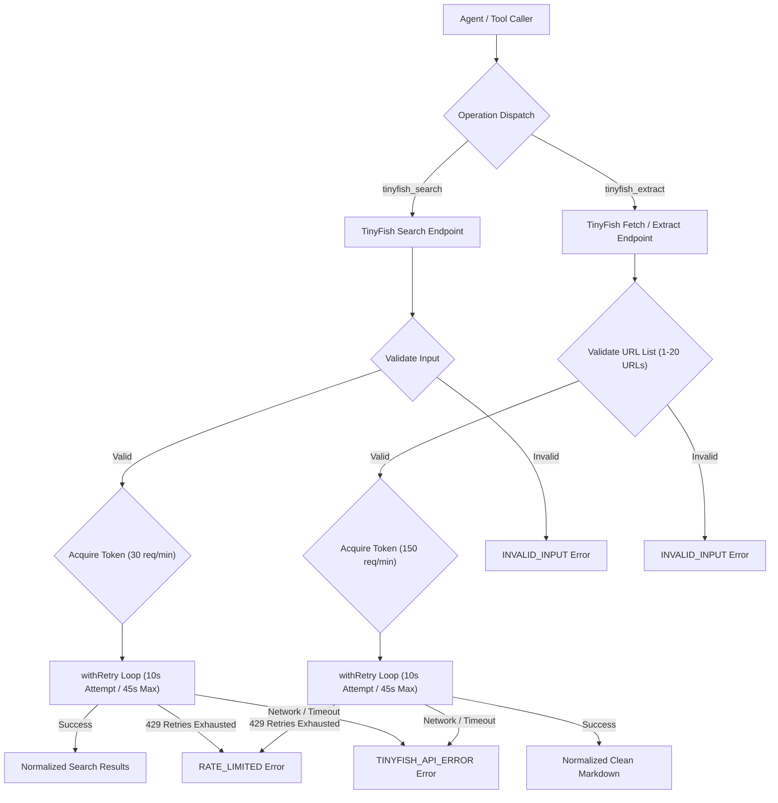

# TinyFish Search integration

The `tinyfish-search` skill provides high-speed web search and clean Markdown URL extraction via the TinyFish AI Search and Fetch SDK (`@tiny-fish/sdk@^0.5.0`). All operations enforce fail-closed boundaries, input sanitization, and dual timeout semantics, returning typed `{ ok: true, data }` or `{ ok: false, error }` results without throwing uncaught exceptions.

## Architecture and data flow

```text
Caller
  │
  ├─► tinyfish_search  ──► TinyFish Search API ─► SearchOutput
  └─► tinyfish_extract ──► TinyFish Fetch API  ─► ExtractOutput
```

<details>
<summary>Mermaid source</summary>


</details>

## Operations and interfaces

To invoke `tinyfish-search` programmatically, import operations from `skills/tinyfish-search/dist/index.js` or `skills/tinyfish-search/src/index.ts`:

1. **`tinyfish_search(input, options?)`**: Dispatches web search queries with query fallback resolution and result normalization.
2. **`tinyfish_extract(input, options?)`**: Fetches 1 to 20 valid HTTP/HTTPS URLs and converts raw HTML into normalized Markdown.

## Rate limiting and retry mechanics

- **Search Bucket**: 30 tokens maximum capacity, refilling at 0.5 tokens per second (30 requests/minute).
- **Extract Bucket**: 150 tokens maximum capacity, refilling at 2.5 tokens per second (150 requests/minute).
- **Exponential Backoff**: Up to 3 retries with randomized jitter on HTTP 429 status codes.
- **Per-Attempt Timeout**: 10 seconds enforced via `AbortSignal.timeout(10_000)`.
- **Cumulative Deadline**: 45 seconds total duration across all retries before aborting.

## Configuration and authentication

To configure credentials via environment variables, set:
```bash
export TINYFISH_API_KEY="your-tinyfish-api-key"
```

To pass credentials on a per-request basis, supply `apiKey` within `RuntimeOptions`:
```typescript
const result = await tinyfish_search(
  { objective: "PostgreSQL 17 release notes" },
  { apiKey: process.env.TINYFISH_API_KEY }
);
```

## Error handling contract

All operations return typed error objects with sanitized error messages:
- `API_KEY_MISSING`: Credentials were not found in environment variables or runtime options.
- `INVALID_INPUT`: Inputs failed schema validation (e.g., missing query or invalid URL protocols).
- `INVALID_API_RESPONSE`: The upstream API returned malformed or non-array payloads.
- `RATE_LIMITED`: The token bucket was exhausted or upstream returned HTTP 429 after 3 retry attempts.
- `TINYFISH_API_ERROR`: Network connection timed out, transport failed, or provider encountered internal errors.
